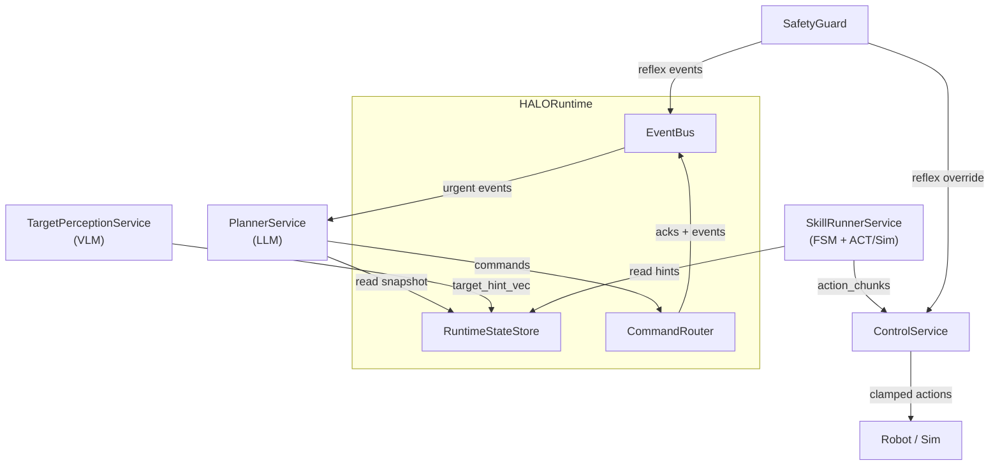

# HALO

HALO is a robotic manipulation system that decouples continuous motor control from LLM-based task reasoning. The robot never pauses motion waiting for the planner — perception and control run machine-to-machine at 10-100 Hz, while an LLM agent orchestrates skills asynchronously. Safety-critical decisions live outside the LLM loop entirely.

The architecture is robot-agnostic — any 5+ DOF arm with a gripper can be integrated by providing an IK solver and controller mapping. The current development target is the [SO-ARM101](https://github.com/TheRobotStudio/SO-ARM100) (5-DOF + 1-DOF gripper), validated in MuJoCo simulation.

The system supports both local inference (Ollama) and cloud backends (Google Gemini via Cloud Run), with automatic failover between them. A terminal UI provides real-time monitoring, operator interaction, and voice control through the cloud backend's Live API.

## Key Features

- **Continuous control** — 50-100 Hz action streaming with temporal ensembling, independent of LLM latency
- **LLM task planner** — ADK ReAct agent that orchestrates pick/place/track skills via async commands
- **Mermaid-authored FSMs** — skill state machines defined as Mermaid diagrams, executed by a generic FSM engine
- **Dual perception pipeline** — fast tracking loop (10-30 Hz) + async VLM scene analysis (off critical path)
- **Deterministic safety** — per-timestep delta clamping, hint freshness gating, reflex layer; LLM cannot bypass
- **Cognitive backend switching** — Switchboard routes LLM/VLM calls to LOCAL (Ollama) or CLOUD (Gemini), with automatic failover, warm-up handoff, and split-brain prevention via LeaseManager
- **MuJoCo simulation** — SO-101 env with trajectory-planned teachers, 64-candidate grasp planner, jerk-limited motion, autonomous ZMQ sim server
- **Terminal UI** — Textual-based TUI with mock, live-local, and live-cloud modes
- **Voice interaction** — audio capture/playback through cloud backend's Gemini Live API
- **JSONL observability** — per-session run logs with full event and VLM result capture

## System Overview



## Quickstart

```bash
# Install dependencies
make install

# Launch TUI in mock mode (no external services needed)
make tui-mock

# Launch with local Ollama + MuJoCo sim (3 terminals)
make run-sim           # terminal 1: MuJoCo sim server
make tui-live          # terminal 2: TUI with Ollama planner + VLM

# Cloud mode (requires HALO_CLOUD_URL or local cloud service)
make run-cloud-service          # terminal 1: cloud service (needs GOOGLE_API_KEY)
make tui-live-cloud-local       # terminal 2: TUI against local cloud service
```

## GCP Deployment

The cloud service deploys to Google Cloud Run with Terraform. It provides HTTP endpoints for planner decisions and VLM scene analysis, plus WebSocket endpoints for the Live Agent (voice/text). See [cloud_service/README.md](cloud_service/README.md) for the service itself and [infra/README.md](infra/README.md) for Terraform configuration.

## Project Status

| Component | Status |
|---|---|
| Contracts, Runtime, EventBus, CommandRouter | Done |
| ControlService + TemporalEnsembling + SafetyGuard | Done |
| SkillRunnerService + Mermaid FSM engine | Done |
| PlannerService + ADK ReAct agent | Done |
| TargetPerceptionService (mock + VLM pipeline) | Done |
| Cognitive backend switching (Switchboard, LeaseManager) | Done |
| TUI (mock + live modes) + RunLogger | Done |
| ZMQ bridge to MuJoCo sim | Done |
| MuJoCo sim (SO-101 env, teachers, grasp planner, SimServer) | Done |
| Integration tests (Ollama-backed) | Done |
| Isaac Lab extension | Planned |

## Repository Structure

```
halo/                  # Core runtime, services, contracts, TUI
  contracts/           # Enums, snapshots, commands, events, actions + JSON schemas
  runtime/             # StateStore, EventBus, CommandRouter, HALORuntime
  services/            # PlannerService, SkillRunnerService, ControlService, TargetPerceptionService
  cognitive/           # Switchboard, LeaseManager, ContextStore, local/remote backends
  bridge/              # ZMQ 2-channel bridge to MuJoCo sim
  tui/                 # Textual TUI app + RunLogger
  configs/             # Planner/perception prompts, Mermaid FSM definitions
mujoco_sim/            # MuJoCo + SO-101 sim (env, teachers, SimServer)
cloud_service/         # Cloud Run service (Gemini planner + VLM + Live Agent)
infra/                 # Terraform GCP configuration
tests/                 # Unit tests (~740 HALO + 116 sim + 20 cloud)
integration/           # LLM integration tests (require Ollama)
docs/                  # Architecture and developer reference
```

## Documentation

- [Architecture](docs/halo_architecture.md) — system design, dataflows, safety, cloud integration
- [Developer Reference](docs/README.md) — repo structure, service internals, testing, workflow
- [MuJoCo Sim](mujoco_sim/CLAUDE.md) — env, dataset format, grasp planner, SimServer
- [Cloud Service](cloud_service/README.md) — endpoints, Live Agent, deployment
- [Infrastructure](infra/README.md) — Terraform GCP setup
