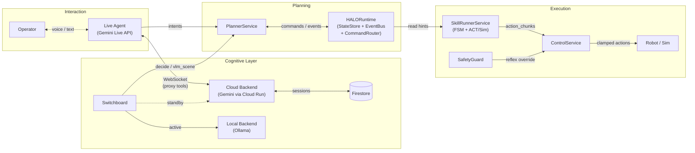
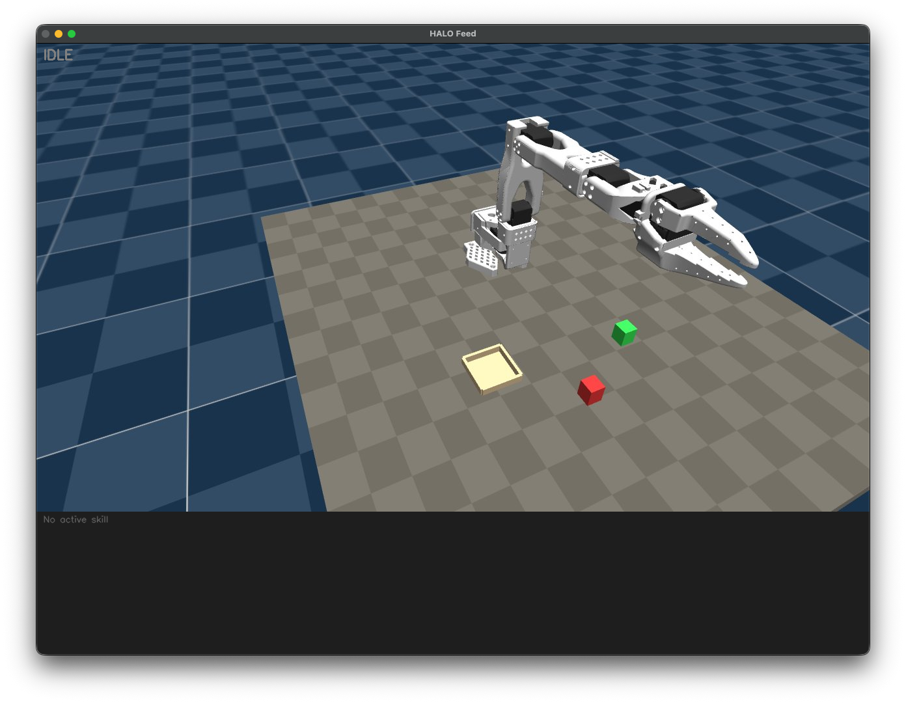
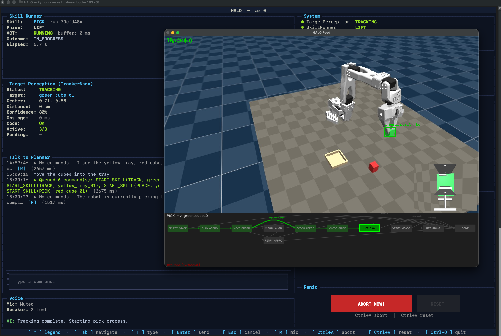
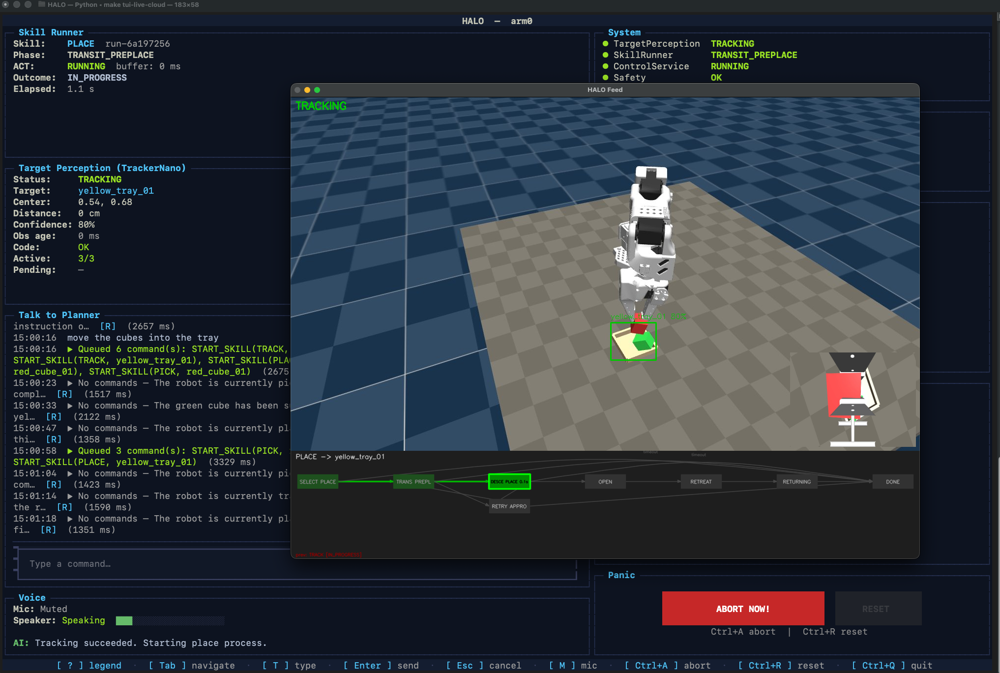

# HALO

HALO is a robotic manipulation system that decouples continuous motor control from LLM-based task reasoning. The robot never pauses motion waiting for the planner — perception and control run machine-to-machine at 10-100 Hz, while an LLM agent orchestrates skills asynchronously. Safety-critical decisions live outside the LLM loop entirely.

The architecture is robot-agnostic — any 5+ DOF arm with a gripper can be integrated by providing an IK solver and controller mapping. The current development target is the [SO-ARM101](https://github.com/TheRobotStudio/SO-ARM100) (5-DOF + 1-DOF gripper), validated in MuJoCo simulation.

Operators interact with the robot through **natural voice and text conversation** powered by the **Gemini Live API**. A Live Agent narrates what the robot is doing, answers questions about the scene, and translates spoken instructions into planner actions — no programming or GUI needed. The system supports both local inference (Ollama) and cloud backends (Google Gemini via Cloud Run), with automatic failover between them.

## Key Features

- **Live Agent (Gemini Live API)** — conversational voice/text interface for operator interaction; narrates robot actions, answers scene questions, forwards intents to the planner via proxy-tool architecture; multilingual with session memory
- **Cognitive backend switching** — Switchboard routes LLM/VLM calls to LOCAL (Ollama) or CLOUD (Gemini), with automatic failover/failback and split-brain prevention via LeaseManager
- **Voice interaction** — bidirectional audio streaming (16 kHz capture / 24 kHz playback) with barge-in support and real-time transcription
- **LLM task planner** — ADK ReAct agent that orchestrates pick/place/track skills via async commands
- **Continuous control** — 50-100 Hz action streaming with temporal ensembling, independent of LLM latency
- **Dual perception pipeline** — fast tracking loop (10-30 Hz) + async VLM scene analysis (off critical path)
- **Deterministic safety** — per-timestep delta clamping, hint freshness gating, reflex layer; LLM cannot bypass
- **Visual FSM engine** — skill state machines defined as Mermaid diagrams, executed by a generic FSM engine
- **MuJoCo simulation** — robot-agnostic env with trajectory-planned teachers, 64-candidate grasp planner, jerk-limited motion, autonomous ZMQ sim server
- **Terminal UI** — Textual-based TUI with mock, live-local, and live-cloud modes
- **JSONL observability** — per-session run logs with full event and VLM result capture

## System Overview



## Screenshots







## Quickstart

```bash
# Install dependencies
make install

# Launch TUI in mock mode (no external services needed)
make tui-mock

# Launch with local Ollama + MuJoCo sim (3 terminals)
make run-sim           # terminal 1: MuJoCo sim server
make tui-live          # terminal 2: TUI with Ollama planner + VLM

# Cloud mode — local cloud service (requires GOOGLE_API_KEY)
make run-cloud-service          # terminal 1: cloud service
make tui-live-cloud-local       # terminal 2: TUI against local cloud service

# Cloud mode — deployed Cloud Run (reads URL + SA from terraform outputs)
make tui-live-cloud              # TUI against deployed cloud service
```

## GCP Deployment

The cloud service deploys to Google Cloud Run with Terraform. It provides HTTP endpoints for planner decisions and VLM scene analysis, plus WebSocket endpoints for the Live Agent (voice/text). See [cloud_service/README.md](cloud_service/README.md) for the service itself and [infra/README.md](infra/README.md) for Terraform configuration.

## Project Status

| Component | Status |
|---|---|
| Contracts, Runtime, EventBus, CommandRouter | Done |
| ControlService + TemporalEnsembling + SafetyGuard | Done |
| SkillRunnerService + Mermaid FSM engine | Done |
| PlannerService + ADK ReAct agent | Done |
| TargetPerceptionService (mock + VLM pipeline) | Done |
| Cognitive backend switching (Switchboard, LeaseManager) | Done |
| TUI (mock + live modes) + RunLogger | Done |
| ZMQ bridge to MuJoCo sim | Done |
| MuJoCo sim (SO-101 env, teachers, grasp planner, SimServer) | Done |
| Integration tests (Ollama-backed) | Done |
| ACT model training (imitation learning from teacher demos) | Planned |
| Isaac Lab extension (GPU-accelerated parallel envs) | Planned |
| Sim-to-real transfer + real hardware deployment | Planned |

## Repository Structure

```
halo/                  # Core runtime, services, contracts, TUI
  contracts/           # Enums, snapshots, commands, events, actions + JSON schemas
  runtime/             # StateStore, EventBus, CommandRouter, HALORuntime
  services/            # PlannerService, SkillRunnerService, ControlService, TargetPerceptionService
  cognitive/           # Switchboard, LeaseManager, ContextStore, local/remote backends
  bridge/              # ZMQ 2-channel bridge to MuJoCo sim
  tui/                 # Textual TUI app + RunLogger
  configs/             # Planner/perception prompts, Mermaid FSM definitions
mujoco_sim/            # MuJoCo + SO-101 sim (env, teachers, SimServer)
cloud_service/         # Cloud Run service (Gemini planner + VLM + Live Agent)
infra/                 # Terraform GCP configuration
tests/                 # Unit tests (~740 HALO + 116 sim + 20 cloud)
integration/           # LLM integration tests (require Ollama)
docs/                  # Architecture and developer reference
```

## Documentation

- [Architecture](docs/halo_architecture.md) — system design, dataflows, safety, cloud integration
- [Developer Reference](docs/README.md) — repo structure, service internals, testing, workflow
- [MuJoCo Sim](mujoco_sim/CLAUDE.md) — env, dataset format, grasp planner, SimServer
- [Cloud Service](cloud_service/README.md) — endpoints, Live Agent, deployment
- [Infrastructure](infra/README.md) — Terraform GCP setup
