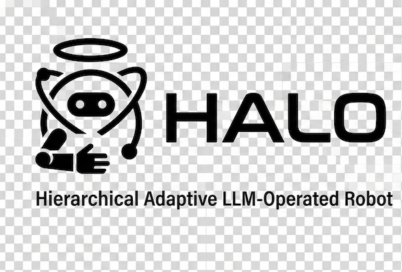

HALO is a robotic manipulation system that decouples continuous motor control from LLM-based task reasoning. The robot never pauses motion waiting for the planner — perception and control run machine-to-machine at 10-100 Hz, while an LLM agent orchestrates skills asynchronously. Safety-critical decisions live outside the LLM loop entirely.

The architecture is robot-agnostic — any 5+ DOF arm with a gripper can be integrated by providing an IK solver and controller mapping. The current development target is the [SO-ARM101](https://github.com/TheRobotStudio/SO-ARM100) (5-DOF + 1-DOF gripper), validated in MuJoCo simulation.

Operators interact with the robot through **natural voice and text conversation** powered by the **Gemini Live API**. A Live Agent narrates what the robot is doing, answers questions about the scene, and translates spoken instructions into planner actions — no programming or GUI needed. The system supports both local inference (Ollama) and cloud backends (Google Gemini via Cloud Run), with automatic failover between them.

## Key Features

- **Live Agent (Gemini Live API)** — conversational voice/text interface for operator interaction; narrates robot actions, answers scene questions, forwards intents to the planner via proxy-tool architecture; multilingual with session memory
- **Cognitive backend switching** — Switchboard routes LLM/VLM calls to LOCAL (Ollama) or CLOUD (Gemini), with automatic failover/failback and split-brain prevention via LeaseManager
- **Voice interaction** — bidirectional audio streaming (16 kHz capture / 24 kHz playback) with barge-in support and real-time transcription
- **Small, fast models** — runs on modest hardware: planner uses a 20B-parameter LLM (`gpt-oss:20b`), perception uses a 3B-parameter VLM (`qwen2.5vl:3b`), cloud uses Gemini 3.1 Flash-Lite — no large frontier models needed
- **LLM task planner** — ADK ReAct agent that orchestrates pick/place/track skills via async commands
- **Continuous control** — 50-100 Hz action streaming with temporal ensembling, independent of LLM latency
- **Dual perception pipeline** — fast tracking loop (10-30 Hz) + async VLM scene analysis (off critical path)
- **Deterministic safety** — per-timestep delta clamping, hint freshness gating, reflex layer; LLM cannot bypass
- **Visual FSM engine** — skill state machines defined as Mermaid diagrams, executed by a generic FSM engine
- **MuJoCo simulation** — robot-agnostic env with trajectory-planned teachers, 64-candidate grasp planner, jerk-limited motion, autonomous ZMQ sim server
- **Terminal UI** — Textual-based TUI with mock, live-local, and live-cloud modes
- **JSONL observability** — per-session run logs with full event and VLM result capture

## System Overview



## Screenshots


## Demo

[](https://www.youtube.com/watch?v=hIvHln6MW2w)

## Prerequisites

- **Python 3.13+** and [**uv**](https://docs.astral.sh/uv/) package manager
- `make install` — installs all dependencies (including MuJoCo)

## Quickstart

```bash
make install
```

### Ollama setup (local inference)

Live-local and integration tests require [Ollama](https://ollama.com). Install it, then pull the two models:

```bash
# macOS / Linux — install Ollama
curl -fsSL https://ollama.com/install.sh | sh

# Pull the planner LLM and the perception VLM
ollama pull gpt-oss:20b        # 20B planner (used by PlannerService)
ollama pull qwen2.5vl:3b       # 3B VLM (used by TargetPerceptionService)
```

Verify Ollama is running and models are available:

```bash
ollama list   # should show both models
```

### Running

#### Cloud mode — deployed Cloud Run (recommended)

```bash
make tui-live-cloud    # reads URL + SA from terraform outputs
```

See [GCP Deployment](#gcp-deployment) below for setup.

#### Cloud mode — local development (2 terminals)

```bash
GOOGLE_API_KEY=<key> make run-cloud-service   # terminal 1: cloud service (Gemini)
make tui-live-cloud-local                      # terminal 2: TUI (sim server auto-started)
```

#### Local mode (Ollama + MuJoCo sim)

```bash
make tui-live          # starts sim server automatically, connects to local Ollama
```

#### Mock mode (no external services needed)

```bash
make tui-mock
```

The MuJoCo sim server is spawned automatically by the TUI in managed mode (`--source mujoco`). Use `make sim-server` only if you need to run it standalone.

## GCP Deployment

The cloud service deploys to Google Cloud Run with Terraform. It uses **Gemini 3.1 Flash-Lite** for both planner decisions and VLM scene analysis, plus **Gemini 2.5 Flash Live Preview** for the Live Agent's bidirectional audio — fast, cheap models that keep latency low and costs minimal.

### Prerequisites

- GCP account with billing enabled, [gcloud CLI](https://cloud.google.com/sdk/docs/install), [Terraform >= 1.5](https://developer.hashicorp.com/terraform/install)
- A [Gemini API key](https://aistudio.google.com/apikey)
- GCP permissions: **Owner**, or at minimum `serviceUsageAdmin`, `iam.serviceAccountAdmin`, `artifactregistry.admin`, `secretmanager.admin`, `run.admin`, `datastore.owner`

Authenticate and enable the bootstrap API (required before Terraform can manage the rest):

```bash
gcloud auth application-default login

PROJECT_ID=your-project-id
gcloud services enable serviceusage.googleapis.com    --project=$PROJECT_ID
gcloud services enable artifactregistry.googleapis.com --project=$PROJECT_ID
gcloud services enable run.googleapis.com              --project=$PROJECT_ID
gcloud services enable secretmanager.googleapis.com    --project=$PROJECT_ID
gcloud services enable firestore.googleapis.com        --project=$PROJECT_ID
gcloud services enable iam.googleapis.com              --project=$PROJECT_ID
```

### Deploy

```bash
# 1. Configure Terraform variables
cp infra/terraform.tfvars.example infra/terraform.tfvars
# Edit terraform.tfvars — set project_id (and optionally invoker_impersonators)

# 2. Bootstrap infrastructure (registry, secrets, SAs, Firestore — no Cloud Run yet)
make tf-init
make tf-bootstrap

# 3. Configure Docker auth for Artifact Registry (one-time)
gcloud auth configure-docker $(cd infra && terraform output -raw artifact_registry | cut -d/ -f1)

# 4. Add your Gemini API key to Secret Manager (one-time)
echo -n "YOUR_GEMINI_KEY" | gcloud secrets versions add google-api-key \
  --project=$(cd infra && terraform output -raw project_id) --data-file=-

# 5. Build image, push to registry, deploy Cloud Run service
make deploy-cloud
```

Subsequent deploys only need `make deploy-cloud`. To rotate the API key, repeat step 4.

### Connect the TUI

The TUI authenticates to Cloud Run by impersonating the invoker service account. Add your email to `invoker_impersonators` in `infra/terraform.tfvars`:

```hcl
invoker_impersonators = ["user:you@example.com"]
```

Then apply and connect:

```bash
cd infra && terraform apply && cd ..
make tui-live-cloud    # reads URL + SA from terraform outputs
```

See [cloud_service/README.md](cloud_service/README.md) for endpoints, env vars, local testing, and key-file auth. See [infra/README.md](infra/README.md) for Terraform variables and resource details.

## Generating Training Data

Teacher episodes are generated in MuJoCo using trajectory-planned demonstrations. These produce the dataset that ACT (Action Chunking with Transformers) will train on.

```bash
# Generate 16 pick episodes (default)
make generate-episodes

# Generate with video previews (requires opencv)
make generate-episodes-video

# Generate pick-and-place episodes with video
make generate-episodes-place
```

Tune with environment variables:

```bash
make generate-episodes EPISODES=100 SEED_BASE=0 EPISODE_DIR=data/episodes
```

- `EPISODES` — number of episodes to generate (default: 16)
- `SEED_BASE` — starting random seed for reproducibility (default: 0)
- `EPISODE_DIR` — output directory (default: `data/episodes`)

Each episode records joint-position trajectories, gripper commands, and observations in a consistent dataset schema shared across sim and real hardware. See [mujoco_sim/CLAUDE.md](mujoco_sim/CLAUDE.md) for dataset format details.

## Project Status

| Component | Status |
|---|---|
| Contracts, Runtime, EventBus, CommandRouter | Done |
| ControlService + TemporalEnsembling + SafetyGuard | Done |
| SkillRunnerService + Mermaid FSM engine | Done |
| PlannerService + ADK ReAct agent | Done |
| TargetPerceptionService (mock + VLM pipeline) | Done |
| Cognitive backend switching (Switchboard, LeaseManager) | Done |
| TUI (mock + live modes) + RunLogger | Done |
| ZMQ bridge to MuJoCo sim | Done |
| MuJoCo sim (SO-101 env, teachers, grasp planner, SimServer) | Done |
| Integration tests (Ollama-backed) | Done |
| ACT model training (imitation learning from teacher demos) | Planned |
| Isaac Lab extension (GPU-accelerated parallel envs) | Planned |
| Sim-to-real transfer + real hardware deployment | Planned |

## Repository Structure

```
halo/                  # Core runtime, services, contracts, TUI
  contracts/           # Enums, snapshots, commands, events, actions + JSON schemas
  runtime/             # StateStore, EventBus, CommandRouter, HALORuntime
  services/            # PlannerService, SkillRunnerService, ControlService, TargetPerceptionService
  cognitive/           # Switchboard, LeaseManager, ContextStore, local/remote backends
  bridge/              # ZMQ 2-channel bridge to MuJoCo sim
  tui/                 # Textual TUI app + RunLogger
  configs/             # Planner/perception prompts, Mermaid FSM definitions
mujoco_sim/            # MuJoCo + SO-101 sim (env, teachers, SimServer)
cloud_service/         # Cloud Run service (Gemini planner + VLM + Live Agent)
infra/                 # Terraform GCP configuration
tests/                 # Unit tests (~740 HALO + 116 sim + 20 cloud)
integration/           # LLM integration tests (require Ollama)
docs/                  # Architecture and developer reference
```

## Documentation

- [Architecture](docs/halo_architecture.md) — system design, dataflows, safety, cloud integration
- [Developer Reference](docs/README.md) — repo structure, service internals, testing, workflow
- [MuJoCo Sim](mujoco_sim/CLAUDE.md) — env, dataset format, grasp planner, SimServer
- [Cloud Service](cloud_service/README.md) — endpoints, Live Agent, deployment
- [Infrastructure](infra/README.md) — Terraform GCP setup
