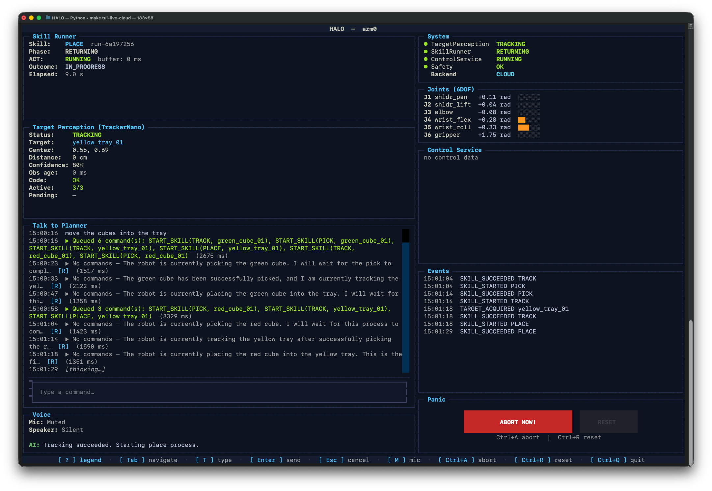
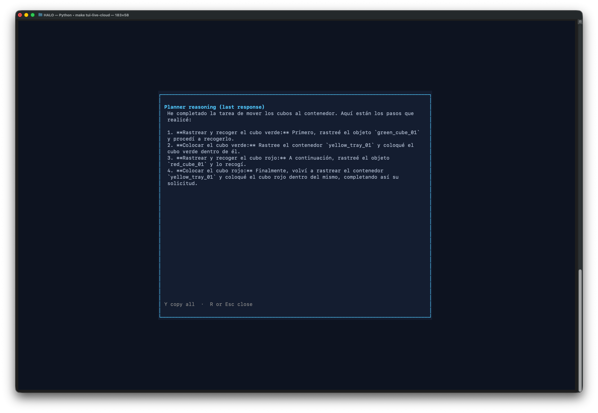

# HALO Developer Reference

Implementation details for developers working in the codebase. For high-level architecture, see [halo_architecture.md](halo_architecture.md).

## Repository Structure

```
halo/
  contracts/                         # Enums, snapshots, commands, events, actions
    enums.py                         # PhaseId, SkillName, SkillFailureCode, PerceptionFailureCode, etc.
    snapshots.py                     # PlannerSnapshot, TargetInfo, ActInfo, SafetyInfo
    commands.py                      # StartSkillCommand, AbortSkillCommand, DescribeSceneCommand, etc.
    events.py                        # Event types (SKILL_SUCCEEDED, PHASE_ENTER, etc.)
    actions.py                       # Action, ActionChunk, ZERO_ACTION
    *.json                           # JSON schemas for enums, commands, events, snapshot
  runtime/
    state_store.py                   # RuntimeStateStore — single source of truth, partitioned by arm_id
    event_bus.py                     # EventBus — async pub/sub, subscribe() returns asyncio.Queue
    command_router.py                # CommandRouter — idempotency, precondition checks, lease validation
    runtime.py                       # HALORuntime — top-level entry point, owns store + bus + router
  services/
    control_service/                 # Real-time action streaming
      config.py                      # ControlConfig
      action_buffer.py               # ActionBuffer
      te_buffer.py                   # TemporalEnsemblingBuffer
      safety_guard.py                # SafetyGuard + reflex layer
      service.py                     # ControlService
    skill_runner_service/            # FSM engine + skill execution
      engine/                        # Generic FSM engine
        graph.py                     # FsmGraph, FsmNode, FsmEdge (immutable topology)
        mermaid_parser.py            # parse_mermaid_fsm() → FsmGraph
        handlers.py                  # StateHandler protocol, GlobalGuard protocol
        engine.py                    # FsmEngine (advance, sync_phase, abort, fail)
        skill_run.py                 # SkillRun (runtime state), NodeStatus, TransitionRecord
        queue.py                     # SkillQueue (FIFO, max_size=16)
        definitions.py              # SkillDefinition, SkillRegistry, build_default_registry()
        view_model.py                # FsmViewModel, build_fsm_view_model()
      config.py                      # SkillRunnerConfig
      fsm.py                         # Legacy PickFSM (backward compat)
      service.py                     # SkillRunnerService
    planner_service/                 # LLM-based task orchestration
      config.py                      # PlannerConfig
      snapshot_serializer.py         # Snapshot → planner-grade text
      tools.py                       # ADK tool definitions (start_skill, abort_skill, describe_scene)
      agent.py                       # PlannerAgent (ADK ReAct + before_model_callback)
      service.py                     # PlannerService (event-driven tick + 30s watchdog)
    target_perception_service/       # Target tracking + VLM scene analysis
      config.py                      # PerceptionConfig
      service.py                     # TargetPerceptionService (fast loop + async VLM)
      vlm_parser.py                  # VlmDetection, VlmScene, parse_vlm_response()
      ollama_vlm_fn.py               # make_ollama_vlm_fn() → async VlmFn
      mock_fns.py                    # make_mock_capture_fn(), make_mock_tracker_factory_fn()
      handle_match.py                # VLM handle deduplication
      tracker_fn.py                  # Tracker factory
      frame_buffer.py                # Frame buffer for VLM
  cognitive/                         # Backend switching layer
    config.py                        # BackendType, CognitiveConfig, LocalConfig, CloudConfig
    backend.py                       # CognitiveBackend protocol, WarmableBackend extension
    switchboard.py                   # Switchboard — proxy, retry, failover/failback, health loop
    lease.py                         # LeaseManager + Lease — epoch-monotonic grants, UUID token, TTL
    context_store.py                 # ContextStore — append-only journal, cursor-based sync
    compactor.py                     # MessageHistory, CompactionResult
    compaction_plugin.py             # CompactionPlugin — ADK event compaction callback
    local_backend.py                 # LocalCognitiveBackend (ADK + LiteLLM/Ollama + Ollama VLM)
    remote_backend.py                # RemoteCognitiveBackend (HTTP client to Cloud Run)
    live_session.py                  # LivePlannerSession — Gemini Live API management
    live_agent_client.py             # TUI-side WebSocket client for Live Agent
    audio_io.py                      # AudioCapture (16kHz) + AudioPlayback (24kHz)
  bridge/                            # ZMQ bridge to MuJoCo sim
    config.py                        # SimBridgeConfig
    sim_client.py                    # SimClient — thread-safe command + background telemetry
    sim_source.py                    # SimSource — drop-in video source (capture_fn → CapturedFrame)
    transforms.py                    # Coordinate transforms
    sim_tracker_service.py           # Sim-based tracker
  tui/
    app.py                           # Textual TUI — mock + live modes
    run_logger.py                    # RunLogger — JSONL session logs to runs/
  testing/                           # Test framework
    event_recorder.py                # EventRecorder for system tests
    state_seeder.py                  # Seed RuntimeStateStore with test state
    mock_fns.py                      # Shared mock callables
    runner.py                        # Test runner utilities
    metrics.py                       # Test metrics
  configs/
    planner/system_prompt.md         # Core planner agent instructions
    perception/scene_analysis.md     # VLM prompt for object detection
    skills/                          # Per-skill directories
      pick/default.mmd              # PICK skill Mermaid FSM
      place/default.mmd             # PLACE skill Mermaid FSM
      track/default.mmd             # TRACK skill Mermaid FSM
      pick/system_prompt.md          # Skill reference for planner
      place/system_prompt.md         # Skill reference for planner
    live_agent/system_prompt.md      # Conversational voice/text assistant prompt
  models/                            # (planned) act/, vlm/
  tools/                             # (planned) ollama_clients/, zed_capture/, uvc_capture/
  eval/                              # (planned) sim/, real/
mujoco_sim/                          # MuJoCo + SO-101 sim (see mujoco_sim/CLAUDE.md)
cloud_service/                       # Cloud Run service (see cloud_service/README.md)
infra/                               # Terraform GCP config (see infra/README.md)
sim/                                 # Isaac Lab extension (planned)
docs/
  halo_architecture.md               # High-level architecture
  data/                              # gitignored; video.mp4 for video capture simulation
runs/                                # Live TUI session logs (JSONL, gitignored)
tests/                               # Unit tests
integration/                         # LLM integration tests (require Ollama)
  conftest.py                        # Ollama health-check; auto-skips if unavailable
  runs/                              # Timestamped result folders
```

---

## Contracts Layer (`halo/contracts/`)

Shared data types used across all services.

**Enums** (`enums.py`): `PhaseId` (0-52), `SkillName` (PICK/PLACE/TRACK), `SkillFailureCode`, `PerceptionFailureCode`, `SafetyReflexReason`, `TrackingStatus`, `ActStatus`, `WRIST_ACTIVE_PHASES`. Phase IDs are stable across sim and real.

**Snapshots** (`snapshots.py`): `PlannerSnapshot` is the planner-grade view of runtime state. Fields: `snapshot_id`, `arm_id`, `skill/phase`, `target` (hint_valid, confidence, obs_age_ms, delta_xyz_ee, distance_m, center_px, bbox_xywh), `perception`, `act`, `progress`, `outcome`, `safety`, `command_acks`, `recent_events` (ring of 8), `held_object_handle`. All bbox/centroid/center_px values are normalised 0..1.

**Commands** (`commands.py`): Each command carries `command_id` (UUID), `arm_id`, `precondition_snapshot_id`. Stateless commands (`describe_scene`, `track_object`) set `precondition_snapshot_id = None`.

**Events** (`events.py`): `COMMAND_ACCEPTED/REJECTED`, `SKILL_STARTED/SUCCEEDED/FAILED`, `PHASE_ENTER/EXIT`, `PERCEPTION_FAILURE/RECOVERED`, `SCENE_DESCRIBED`, `TARGET_ACQUIRED`, `SAFETY_REFLEX_TRIGGERED/RECOVERED`.

**JSON schemas**: Machine-readable schemas in `enums.json`, `commands.json`, `events.json`, `snapshot.json`.

---

## Runtime (`halo/runtime/`)

**RuntimeStateStore** (`state_store.py`): Single source of truth for all runtime state, partitioned by `arm_id`. Provides `get_latest_runtime_snapshot(arm_id)` and state update methods.

**EventBus** (`event_bus.py`): Async pub/sub. `subscribe()` returns an `asyncio.Queue`. Services publish typed events; the PlannerService subscribes to urgent events.

**CommandRouter** (`command_router.py`): Validates and routes planner commands. Enforces idempotency (duplicate `command_id` → `ALREADY_APPLIED`), precondition checks (stale `snapshot_id` → `REJECTED_STALE`), and lease validation when a LeaseManager is active (checks `epoch` + `lease_token`).

**HALORuntime** (`runtime.py`): Top-level entry point. Owns StateStore, EventBus, and CommandRouter. Exposes `get_latest_runtime_snapshot(arm_id)` and `submit_command(cmd)`.

---

## Service Internals

### PlannerService

Event-driven LLM agent using ADK ReAct. Ticks fire on urgent events (`SKILL_SUCCEEDED`, `SKILL_FAILED`, `SAFETY_REFLEX_TRIGGERED`, `PERCEPTION_FAILURE`, `SCENE_DESCRIBED`, `TARGET_ACQUIRED`, `COMMAND_REJECTED`) plus a 30 s watchdog. Ticks are serialized — `decide_fn` is awaited before the next event is processed.

Three planner tools: `start_skill` (PICK/PLACE/TRACK), `abort_skill`, `describe_scene`. The `before_model_callback` replaces the previous snapshot in LLM context with the latest one (never appends).

### TargetPerceptionService

Fast loop (10 Hz default) + async VLM reacquisition. Accepts injected `ObserveFn` (tracker) and optional `VlmFn` (scene analysis). At most one VLM task at a time; result stored as `_vlm_seed`, consumed by `tick()` when `observe_fn` returns `None`.

VLM handle dedup: `dedupe_detection_handles()` renames duplicates to `{handle}_dup2`, `{handle}_dup3`. All coordinates normalised 0..1 throughout; denormalisation only at OpenCV boundaries.

### SkillRunnerService

Uses the generic FSM engine to execute skills defined as Mermaid diagrams. Key engine components:

- **FsmGraph** (`graph.py`): immutable topology parsed from Mermaid
- **parse_mermaid_fsm()** (`mermaid_parser.py`): Mermaid → FsmGraph
- **StateHandler** (`handlers.py`): per-node handler protocol with `on_enter`, `tick`, `on_exit`
- **FsmEngine** (`engine.py`): `advance()`, `sync_phase()`, `abort()`, `fail()`, `needs_chunk()`
- **SkillRun** (`skill_run.py`): runtime state per skill execution
- **SkillQueue** (`queue.py`): FIFO queue (max 16)
- **SkillRegistry** (`definitions.py`): maps SkillName → SkillDefinition (graph + handlers)

Dual-mode: ACT (chunk_fn/push_fn) or Sim (start_pick_fn/sim_phase_fn). In sim mode, `sync_phase()` performs forward-only transitions based on SimServer telemetry.

`held_object_handle` in the state store tracks what's in the gripper after a successful pick. The planner prompt enforces: if held_object_handle is set, never start another PICK.

### ControlService

Streams actions at the target rate using temporal ensembling to blend overlapping action chunks. The TemporalEnsemblingBuffer blends per-timestep — overlapping predicted deltas become a single commanded delta sequence before IK/OSC mapping. On phase transition, the buffer is trimmed to ~50-100 ms.

Action spaces are intentionally different between core and sim:
- **HALO core**: `[Δx, Δy, Δz, Δroll, Δpitch, Δyaw, gripper_cmd]` — 7D EE-frame deltas
- **MuJoCo sim**: `[shoulder_pan, shoulder_lift, elbow_flex, wrist_flex, wrist_roll, gripper]` — 6D joint positions

Conversion is the responsibility of the `apply_fn` factory.

---

## Cognitive Backend (`halo/cognitive/`)

**Switchboard** (`switchboard.py`): Transparent proxy routing LLM/VLM calls. Retry logic with backoff, failure counting (3 consecutive → failover), health-check failback (5 s loop), context handoff via ContextStore. Services call `switchboard.decide()` / `switchboard.vlm_scene()` as drop-ins.

**LeaseManager** (`lease.py`): Epoch-monotonic grants with UUID token + TTL (30 s default). Renewed on every successful `decide()` / `vlm_scene()`. CommandRouter validates both `epoch` and `lease_token` on every command. Lifecycle: `grant(holder) → renew(epoch) → revoke(epoch) → grant(new_holder)`.

**ContextStore** (`context_store.py`): Append-only journal (bounded to 200 entries) capturing decisions, scenes, events, operator instructions, compaction events. `get_handoff_context()` produces a text summary for backend handoff on switch.

**CompactionPlugin** (`compaction_plugin.py`): ADK-native event compaction callback. Detects compaction boundaries and propagates summaries to the inactive backend for concise failback context.

**Backends**: `LocalCognitiveBackend` wraps PlannerAgent (ADK + LiteLLM/Ollama) + Ollama VLM. `RemoteCognitiveBackend` is an HTTP client to the Cloud Run service.

**Live Agent**: `LivePlannerSession` manages Gemini Live API sessions. `LiveAgentClient` is the TUI-side WebSocket client with `send_tool_result()` and `set_audio_callbacks()`. `AudioCapture` (16 kHz) and `AudioPlayback` (24 kHz) via sounddevice.

---

## Bridge (`halo/bridge/`)

2-channel ZMQ connection to the MuJoCo sim server.

| Channel | ZMQ Pattern | Port | Direction | Purpose |
|---------|-------------|------|-----------|---------|
| TelemetryStream | PUB/SUB | 5560 | Sim → HALO | Frames + state @ 10 Hz |
| CommandRPC | REQ/REP | 5561 | HALO → Sim | step, reset, start_pick, configure, shutdown |

**SimServer** (`mujoco_sim.server`): autonomous physics loop at 20 Hz, plans and executes trajectories, publishes telemetry. Single-threaded (macOS OpenGL). Protocol: msgpack + JPEG.

**SimClient** (`sim_client.py`): thread-safe command interface with background telemetry reception. `BridgeTransportError` on timeout.

**SimSource** (`sim_source.py`): wraps SimClient as a drop-in video source (`capture_fn` → `CapturedFrame`).

No env resets between skills — the arm stays at its final position and sim runs continuously.

---

## Configuration (`halo/configs/`)

- `planner/system_prompt.md` — core planner agent instructions (tool usage, snapshot interpretation, recovery logic)
- `perception/scene_analysis.md` — VLM prompt for object detection (JSON output format, handle naming)
- `skills/pick/default.mmd` — PICK skill Mermaid FSM topology
- `skills/place/default.mmd` — PLACE skill Mermaid FSM topology
- `skills/track/default.mmd` — TRACK skill Mermaid FSM topology
- `skills/pick/system_prompt.md` — PICK skill reference for planner
- `skills/place/system_prompt.md` — PLACE skill reference for planner
- `live_agent/system_prompt.md` — conversational voice/text assistant prompt

---

## Testing

### Test Tiers

1. **Unit tests** (`tests/`): ~740 tests. Pure unit tests for contracts, runtime, services, cognitive. Run with `uv run python -m pytest`.
2. **Component tests**: service-level tests with injected mocks (mock observe_fn, mock chunk_fn).
3. **System tests**: multi-service tests using the testing framework (EventRecorder, StateSeeder).
4. **Integration tests** (`integration/`): require Ollama with `gpt-oss:20b`. Auto-skip if unreachable. Run with `make test-integration`.

Additional: 116 mujoco_sim tests (`make test-sim`), 20 cloud_service tests (`make test-cloud-service`).

### Testing Framework (`halo/testing/`)

- `event_recorder.py` — subscribe to EventBus, collect events for assertions
- `state_seeder.py` — seed RuntimeStateStore with specific state for test scenarios
- `mock_fns.py` — shared mock callables (chunk_fn, push_fn, observe_fn, etc.)
- `runner.py` — test runner utilities
- `metrics.py` — test metrics collection

Conventions: `pytest-asyncio` with `asyncio_mode = "auto"`. Tests use `HALORuntime()` + `register_arm("arm0")`. System tests set `precondition_snapshot_id=None` for `START_SKILL`.

---

## Development Workflow

### Install

```bash
make install                    # uv sync --extra dev
make install-sim                # install mujoco_sim deps
```

### Lint and Format

```bash
make ruff                       # ruff check --fix + ruff format (run before every commit)
```

Ruff config: line-length=120, target py313, select E/F/I/W.

### Test

```bash
uv run python -m pytest                              # all unit tests
uv run python -m pytest tests/test_contracts.py       # single file
uv run python -m pytest -k test_snapshot_ids          # single test by name
make test-sim                                         # mujoco_sim tests
make test-cloud-service                               # cloud_service tests
make test-integration                                 # LLM integration tests (requires Ollama)
make smoke-cloud-service                              # smoke test against Gemini
```

### TUI Modes

```bash
make tui-mock                   # static fixture data, no services needed
make tui-live                   # Ollama planner + VLM + MuJoCo sim
make tui-live-cloud             # HTTP client to cloud service (set HALO_CLOUD_URL)
make tui-live-cloud-local       # cloud service on localhost
```






### Sim

```bash
make run-sim                    # start MuJoCo sim server
make generate-episodes          # generate teacher episodes (EPISODES=10 EPISODE_DIR=episodes SEED_BASE=0)
```


---

## Command Reference

| Command | Description |
|---|---|
| `make install` | Install deps + MuJoCo (`uv sync --extra dev`) |
| `make ruff` | Lint + format (ruff check --fix + ruff format) |
| `make test-sim` | Run mujoco_sim tests |
| `make tui-mock` | TUI in mock mode |
| `make tui-live` | TUI with Ollama + MuJoCo |
| `make tui-live-cloud` | TUI via cloud service HTTP |
| `make tui-live-cloud-local` | TUI against local cloud service |
| `make run-cloud-service` | Run cloud service (needs GOOGLE_API_KEY) |
| `make test-cloud-service` | Cloud service unit tests |
| `make smoke-cloud-service` | Smoke test against Gemini |
| `make generate-episodes` | Generate teacher episodes |
| `make test-integration` | LLM integration tests (needs Ollama) |
