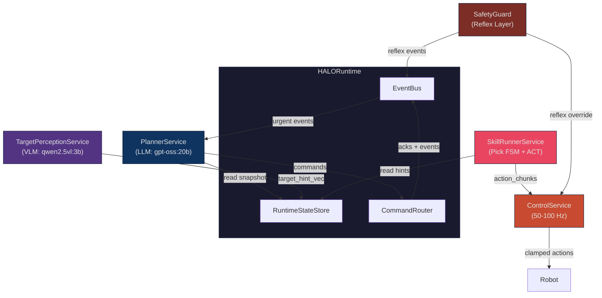
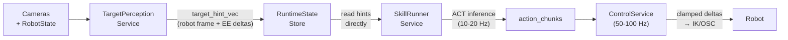
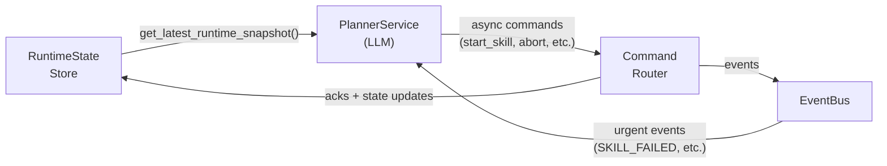
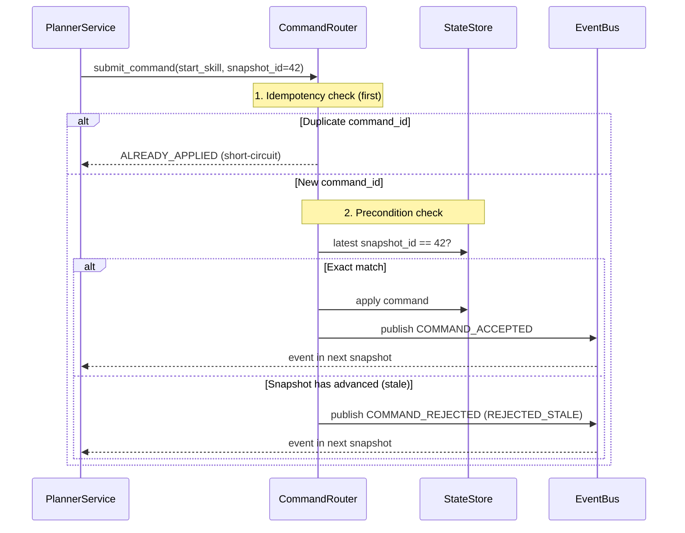
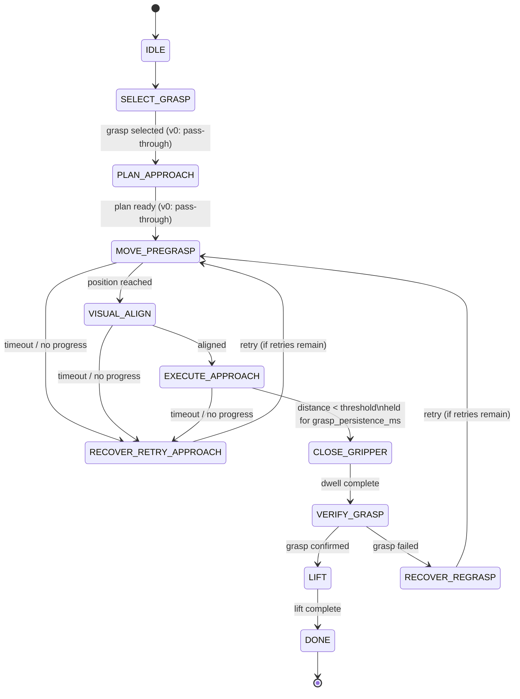
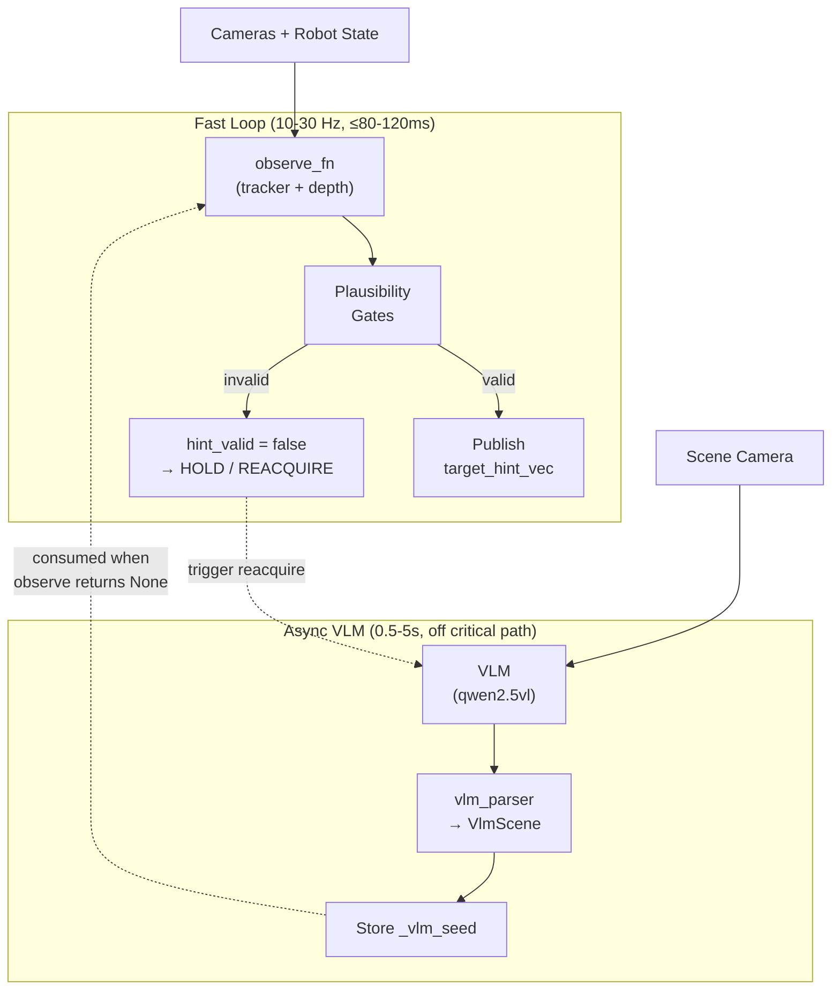
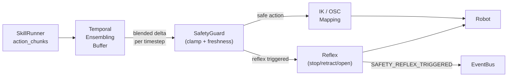
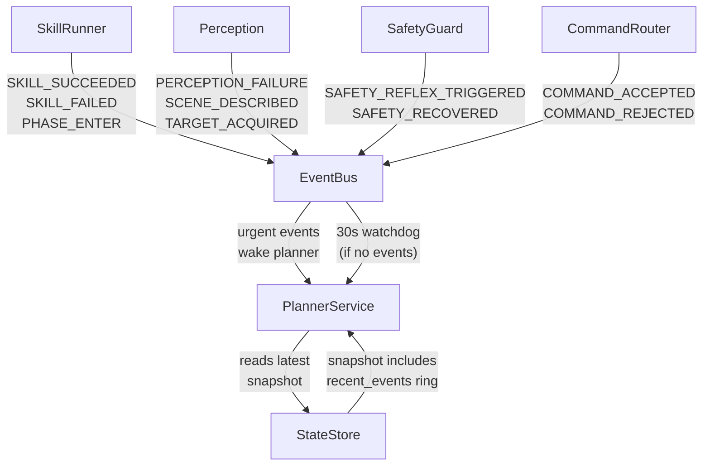
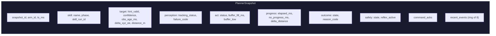

# HALO Architecture

HALO is a robotic manipulation system built around **continuous control decoupled from LLM reasoning** — the robot never pauses motion waiting for the planner.

The project follows a **three-phase sim strategy**: (1) **MuJoCo + SO-101** (current) for teacher demos, ACT training data, and closed-loop eval; (2) **Isaac Lab** (future) for GPU-accelerated parallel envs and domain randomization; (3) **Real SO-ARM101 hardware** (later). The v0 software backbone (services, contracts, planner agent, TUI) is fully implemented and tested.

---

## System Overview

Five services with strict role separation, coordinated through a shared runtime:

| Service | Rate | Role |
|---|---|---|
| **PlannerService** | event-driven (30 s watchdog) | Task orchestration, skill selection, retries, recovery |
| **TargetPerceptionService** | 10–30 Hz + async VLM | Target discovery/tracking, fused hints, failure codes |
| **SkillRunnerService** | 10–20 Hz | Pick FSM, phase transitions, ACT chunk buffering |
| **ControlService** | 50–100 Hz (target); 10 Hz in v0 sim | Real-time action streaming, temporal ensembling, safety |
| **SafetyGuard** | Hard real-time | Delta limits, hint freshness gating, reflexes |



---

## Dataflows

The system has two independent paths — a high-frequency **control path** (machine-to-machine, no LLM) and a low-frequency **decision path** (LLM-driven).

### Control Path

Numeric control hints flow machine-to-machine and never enter LLM context.



### Decision Path

The planner reads compact snapshots and issues async commands. It never blocks the control loop.



---

## Command Protocol

Every mutating command carries a `command_id` (UUID) and `precondition_snapshot_id`. The router enforces idempotency and uses **strict optimistic concurrency**: `precondition_snapshot_id` must exactly equal the current `snapshot_id` (not >=). If the world has moved on, the command is rejected and the planner must re-read and retry.



### Planner Tools

| Tool | Precondition | Purpose |
|---|---|---|
| `start_skill(skill, target, options)` | snapshot_id | Launch a skill (pick, place) |
| `abort_skill(skill_run_id, reason)` | snapshot_id | Abort a running skill |
| `override_target(skill_run_id, handle)` | snapshot_id | Retarget mid-skill |
| `describe_scene(reason)` | None (stateless) | Trigger async VLM scene analysis |
| `track_object(target_handle)` | None (stateless) | Set perception tracking target |

---

## Pick Skill FSM

The SkillRunnerService drives a deterministic FSM. Phase transitions are fast and local — the planner only starts/aborts skills, never times micro-actions.



**Key invariant:** `CLOSE_GRIPPER` is triggered deterministically when `distance < grasp_distance_threshold_m` held for `grasp_persistence_ms`. The planner never commands "close gripper now". Wrist camera is active in `VISUAL_ALIGN`, `EXECUTE_APPROACH`, `CLOSE_GRIPPER`, and `VERIFY_GRASP`.

---

## TargetPerceptionService

Two loops: a fast tracking loop (10–30 Hz) and an async VLM loop for scene analysis/reacquisition.



### Perception Failure Codes

`OK` · `OCCLUDED` · `OUT_OF_VIEW` · `DEPTH_INVALID` · `MULTIPLE_CANDIDATES` · `CALIB_INVALID` · `TRACK_JUMP_REJECTED` · `REACQUIRE_FAILED`

---

## ControlService & Safety

The ControlService applies temporal ensembling to blend overlapping action chunks into smooth per-timestep deltas. Target rate is 50–100 Hz for real hardware; v0 MuJoCo sim uses 10 Hz for debugging simplicity.



### Safety Guards (v0)

- Per-timestep linear delta limit (`max_linear_delta_m`)
- Per-timestep angular delta limit (`max_angular_delta_rad`)
- Hint freshness gating (`obs_age_ms`, `time_skew_ms` thresholds)
- Reflex: immediate stop/retract/open-gripper on unsafe conditions

The LLM cannot bypass safety guards.

---

## Event Flow

Services communicate asynchronously through the EventBus. The planner wakes on urgent events.



### Urgent Events (wake PlannerService)

`SKILL_SUCCEEDED` · `SKILL_FAILED` · `SAFETY_REFLEX_TRIGGERED` · `PERCEPTION_FAILURE` · `SCENE_DESCRIBED` · `TARGET_ACQUIRED` · `COMMAND_REJECTED`

---

## Planner Snapshot

The planner sees exactly **one** compact snapshot (the latest). Old snapshots are replaced, never appended.



---

## ACT Action Space

**HALO core** (runtime/bridge) actions are **per-timestep servo increments** in the end-effector frame:

```
[Δx, Δy, Δz, Δroll, Δpitch, Δyaw, gripper_cmd]   (7D EE-frame deltas)
```

**MuJoCo sim** (`mujoco_sim/`) uses **joint-position targets** written directly to `data.ctrl[:]`:

```
[shoulder_pan, shoulder_lift, elbow_flex, wrist_flex, wrist_roll, gripper]   (6D joint positions)
```

The action spaces are **intentionally different** — conversion is the responsibility of the `apply_fn` factory. Constants sync tests verify phase/gripper alignment but not action format.

- Deltas are applied relative to the **current measured** EE pose (closed-loop)
- Temporal ensembling blends overlapping chunk predictions per-timestep
- On phase transition, the buffer is trimmed to ~50–100 ms to avoid stale tail actions
- **v0 MuJoCo profile:** 20 Hz control (10 Hz ACT), 10-step chunks (1 s horizon). Production target is 50–100 Hz with shorter horizons (200–500 ms).

---

## Timing Budgets

```mermaid
gantt
    title Service Timing Budgets
    dateFormat X
    axisFormat %L ms

    section Control
    ControlService tick (target 50-100 Hz) :0, 20
    ControlService tick (v0 MuJoCo 20 Hz)  :0, 50

    section Skill
    ACT inference (10-20 Hz)           :0, 100

    section Perception
    Fast loop (tracker + depth + gates) :0, 120
    VLM reacquire (async)              :0, 5000

    section Planner
    LLM decide (event-driven)          :0, 5000
    Watchdog fallback                  :0, 30000
```



| Path | Target | v0 Sim |
|---|---|---|
| ControlService tick | 50–100 Hz (10–20 ms) | 20 Hz (50 ms) in MuJoCo |
| Fast perception loop → hint publish | ≤ 80–120 ms | same |
| VLM reacquire (async, off critical path) | 0.5–5 s | same |
| ACT chunk horizon | 200–500 ms | 1 s (10 steps) |
| ACT buffer fill target | 150–300 ms | ~1 s |
| Planner watchdog | 30 s max between ticks | same |

---

## MuJoCo Simulation (`mujoco_sim/`)

Phase 1 of the sim strategy. Raw MuJoCo + SO-101 arm (no robosuite). Generates teacher pick demos, records episodes to HDF5, and bridges to HALO runtime via ZMQ. Separate workspace member with its own `pyproject.toml`.

### SO-101 Robot

5-DOF arm + 1-DOF gripper = 6 actuated joints (position-controlled STS3215 servos).

| Idx | Joint | Range (rad) |
|-----|-------|-------------|
| 0 | `shoulder_pan` | ±1.92 |
| 1 | `shoulder_lift` | ±1.75 |
| 2 | `elbow_flex` | ±1.69 |
| 3 | `wrist_flex` | ±1.66 |
| 4 | `wrist_roll` | -2.74 to 2.84 |
| 5 | `gripper` | -0.17 (closed) to 1.75 (open) |

EE site: `gripperframe` on the `gripper` body. Position actuators with `kp=998.22` track targets written directly to `data.ctrl[:]`.

MJCF: `so101_new_calib.xml` (from SO-ARM100 repo) + `pick_scene.xml` (robot + floor + cube + cameras).

### SO101Env

Raw MuJoCo wrapper with dual cameras, seeded resets, 6D joint-position control.

- **Action space:** 6D joint-position targets `[shoulder_pan, ..., gripper]`
- **Observations:** `rgb_scene` (480,640,3), `rgb_wrist` (240,320,3), `qpos` (13,), `qvel` (12,), `gripper` (float), `ee_pose` (7,), `object_pose` (7,), `joint_pos` (6,)
- **Physics:** `dt=0.005`, control_freq=20 Hz → 10 substeps per `step()`
- **State dims:** nq=13 (6 robot + 7 cube freejoint), nv=12 (6+6), nu=6
- **Seeded resets:** cube position randomized within workspace bounds
- **Key methods:** `reset(seed)`, `step(action)`, `render(camera)`, `get_state()`/`set_state(state)`
- **Properties:** `mujoco_model`, `mujoco_data`, `home_qpos` (6,), `action_dim`

### Trajectory Planning Pipeline

PickTeacher pre-computes a full trajectory on the first `step()` call, then samples in real time:

```
grasp_planner.evaluate_grasps()         →  ScoredGrasp (best of 64 candidates)
    ↓
keyframe_planner.plan_pick_keyframes()  →  5 SE(3) keyframes (pos + ori + gripper + phase_id)
    ↓
waypoint_generator.generate_joint_waypoints()  →  5 joint-space waypoints via IK (yaw-retry fallbacks)
    ↓
trajectory.plan_trajectory()            →  TrajectoryPlan (jerk-limited ruckig segments)
    ↓
pick_teacher.step()                     →  samples plan at elapsed time → (action, phase_id, done)
```

**Grasp planner** (`grasp_planner.py`): 64 candidates (16 per side face, 5° cone around face normal, random yaw). Geometric filter (table collision, pregrasp feasibility), scoring by IK quality + joint margin + manipulability + orientation error. Gripperframe axes: Z=approach, X=jaw/hinge, Y=lateral/span. Exports `GraspPose`, `ScoredGrasp`, `GraspPlanningFailure`.

**IK solvers** (`ik_helper.py`, damped least-squares):
- `solve_ik(model, data, target_pos, ...)` — position-only (3×5 Jacobian), operates on copy of data
- `solve_ik_with_orientation(model, data, target_pos, target_rot, ...)` — single-phase coupled 6D: position + orientation optimized simultaneously from iter 1. Weighted Jacobian `[pos_weight*Jp; ori_weight*Jr]`, ori_weight=0.3, 300 iters, 0.1 rad/iter step limit.

**Keyframe planner** (`keyframe_planner.py`): 5 Cartesian keyframes from cube pose + home joints: `home → pregrasp → grasp → grasp_closed → lift`. Each `Keyframe` has position (3,), orientation (3×3), gripper, phase_id, label.

**Waypoint generator** (`waypoint_generator.py`): Solves IK for each keyframe, seeded from previous solution. Yaw-retry fallback: `[0°, 90°, -90°, 180°]` if IK fails. Lift phase uses position-only IK with relaxed tolerance (0.03 m). Raises `IKFailure` if unreachable.

**Trajectory** (`trajectory.py`, ruckig): Jerk-limited segments between waypoint pairs. All segments start/end at rest (v=0, a=0). Gripper interpolated linearly. Default limits: vel `[1.0,1.0,1.0,1.0,1.5]`, accel `[3.0,3.0,3.0,3.0,4.0]`, jerk `[10.0,10.0,10.0,10.0,15.0]`. `TrajectoryPlan.sample(t) → (arm_joints[5], gripper, phase_id)`.

**Teacher phase sequence:**
```
IDLE(0) → MOVE_PREGRASP(3) → EXECUTE_APPROACH(5) → CLOSE_GRIPPER(6) → LIFT(8) → DONE(9)
```
SELECT_GRASP, PLAN_APPROACH, and VISUAL_ALIGN are folded into planning (instantaneous). VERIFY_GRASP is implicit in the gripper-close segment.

### Scene Constants (`scene_info.py`)

Single source of truth for all grasp planner and teacher defaults — never use magic numbers.

| Constant | Value | Purpose |
|----------|-------|---------|
| `TCP_PINCH_OFFSET_LOCAL` | `[0,0,0]` | Zeroed (3-4 mm actual offset hurts more via IK error) |
| `DEFAULT_FACE_STANDOFF` | 0.003 m | Outward offset to prevent jaw overshoot |
| `DEFAULT_GRASP_N_CANDIDATES` | 64 | Grasp candidates (16 per side face) |
| `DEFAULT_GRASP_MAX_CONE_DEG` | 5° | Cone angle for approach direction sampling |
| `DEFAULT_CUBE_FACE_CONTACT_SPAN` | 0.10 | Tangential sampling range on cube faces |
| `DEFAULT_PREGRASP_STANDOFF` | 0.08 m | Pregrasp distance along approach direction |
| `DEFAULT_LIFT_HEIGHT` | 0.08 m | Lift distance above grasp contact |
| `DEFAULT_ORI_TOL_DEG` | 55° | IK orientation tolerance (5-DOF arm kinematic limit) |
| `DEFAULT_IK_POS_TOL` | 0.03 m | IK position tolerance |

`SceneInfo.from_model(model)` extracts runtime geometry (`cube_half_sizes`, `cube_default_pos`, `table_z`) from MuJoCo model. Entity names: `CUBE_GEOM_NAME`, `CUBE_BODY_NAME`, `TABLE_BODY_NAME`, `EE_SITE_NAME`.

### Contact Solver Tuning (`pick_scene.xml`)

MuJoCo's soft contact model allows friction slip by default. Three solver-level settings suppress slippage:

```xml
<option impratio="10" cone="elliptic" noslip_iterations="3"/>
```

- **`impratio=10`** — friction constraints 10× stiffer than normal force
- **`cone="elliptic"`** — accurate friction cones (required for high impratio)
- **`noslip_iterations=3`** — post-processing solver that eliminates residual slip

Gripper collision geoms: `friction="2.0 0.1 0.001" condim="4"`. Gripper actuator force: `±6.0 N` (increased from default ±3.35 N). Episode generation achieves **100% success rate** (10/10) with these settings.

### Dataset Format (HDF5)

One file per episode (`ep_NNNNNN.hdf5`):

```
ep_000000.hdf5
├── obs/
│   ├── rgb_scene    (T, H, W, 3) uint8  [gzip]
│   ├── rgb_wrist    (T, H, W, 3) uint8  [gzip]
│   ├── qpos         (T, 13)
│   ├── qvel         (T, 12)
│   ├── gripper      (T,)
│   ├── ee_pose      (T, 7)
│   ├── joint_pos    (T, 6)             [if present]
│   ├── phase_id     (T,) int32         [if present]
│   ├── object_pose  (T, 7)             [if present]
│   └── contacts/    step_NNNNNN (N,)   [if present]
├── action           (T, 6)
└── attrs: seed, env_name, robot, control_freq, num_steps, created_at
```

In-memory: `Timestep` dataclass → `RawEpisode` buffer with `append()`, indexing, slicing, bulk numpy accessors (`rgb_scenes`, `qpos_array`, `actions`, `phase_ids`). `EpisodeMetadata` carries seed, env_name, robot, control_freq.

### Episode Generation

`run_teacher(num_episodes, output_dir, ...)` generates episodes via ZMQ SimClient (managed or standalone):

1. Reset env (seeded cube randomization)
2. Stabilize 5 s at `home_qpos` (physics settling before recording)
3. Teacher loop: `step(obs, model, data) → (action, phase_id, done)`
4. Write HDF5
5. Verify lift success (cube Δz ≥ 5 mm during LIFT phase — uses max Z, not final Z)

Returns `EpisodeResult` per episode (idx, seed, path, success, num_steps, final_phase, error).

### Constants Sync

Phase IDs, gripper semantics, wrist-active phases defined in both `halo/contracts/enums.py` and `mujoco_sim/constants.py`. Cross-module sync tests verify alignment:
- `tests/test_mujoco_sim_contract_sync.py` (3 tests at repo root)
- `mujoco_sim/tests/test_constants_sync.py` (6 tests)

Action space intentionally diverged (sim: 6D joint-position, core: 7D EE-delta) — verified but not synchronized by design.

### Test Coverage (112 tests)

| Test file | Count | Coverage |
|-----------|-------|----------|
| `test_constants_sync.py` | 6 | Phase IDs, action fields, gripper, wrist phases |
| `test_raw_episode.py` | 29 | Timestep, RawEpisode, HDF5 roundtrip, metadata |
| `test_pick_teacher.py` | 20 | Teacher phases, transitions, actions, full episode |
| `test_grasp_planner.py` | 18 | Grasp enumeration, filtering, scoring |
| `test_trajectory_pipeline.py` | 24 | Keyframes → IK → ruckig integration |
| `test_server.py` | 15 | Protocol serialization, command dispatch |

### Development Roadmap

| PR | Status | Scope |
|----|--------|-------|
| PR1 — Environment + Constants | done | SO101Env, constants sync |
| PR2 — Episode Recording Format | done | Timestep, RawEpisode, HDF5 writer/reader |
| PR3 — Teacher Runner | done | PickTeacher, trajectory pipeline, grasp planner, episode runner |
| PR4 — Offline Phase Detection | pending | PickPhaseDetector, guards.py |
| PR5 — VCR Replay Engine | planned | VCRPlayer, ViewerApp, PhaseOverlay |
| PR6 — Manual Phase Annotation | planned | PhaseTrack, AnnotationUI, annotation_io |

### Dependencies

```
numpy, h5py>=3.0, tqdm>=4.60, ruckig>=0.14
Optional: mujoco>=3.1.6 (sim), pyzmq>=25 + msgpack>=1.0 (server), opencv-python>=4.8 (viewer/server)
```

---

## ZMQ Bridge (`halo/bridge/`)

Connects the HALO runtime to the MuJoCo simulation server via a 2-channel ZMQ protocol.

### Channel Architecture

| Channel | ZMQ Pattern | Default Port | Direction | Purpose |
|---------|-------------|--------------|-----------|---------|
| **TelemetryStream** | PUB/SUB | 5560 | Sim → HALO | Frames + state at render_fps (10 Hz default) |
| **CommandRPC** | REQ/REP | 5561 | HALO → Sim | step, reset, teacher_step, configure, set_hint, shutdown |

Single-threaded sim server (required for macOS OpenGL rendering). Protocol: msgpack for structured data, raw bytes for numpy arrays, JPEG for camera frames (quality 85).

### Dataflow

```
MuJoCo SimServer (mujoco_sim.server)
├── SO101Env (raw MuJoCo, SO-101 robot)
├── PickTeacher (trajectory-planned policy)
└── ZMQ Sockets
    ├── PUB (TelemetryStream @ 5560)
    │   └── publishes: frames, qpos, qvel, phase_id, done — every 100ms (10 Hz)
    └── REP (CommandRPC @ 5561)
        └── handles: step, reset, teacher_step, configure, shutdown

HALO Runtime (halo/)
├── SimClient (halo/bridge/sim_client.py)
│   ├── Background telemetry thread (SUB, receives frames @ 10 Hz)
│   └── Main thread (REQ, sends commands, thread-safe via _cmd_lock)
├── SimSource (halo/bridge/sim_source.py)
│   └── Wraps SimClient → capture_fn + frame queue for TargetPerceptionService
└── ControlService
    └── apply_fn(arm_id, action) → SimClient.step(action)
```

### SimClient (`halo/bridge/sim_client.py`)

HALO-side ZMQ client with background telemetry receiver thread.

**Key methods:** `start(timeout)`, `stop()`, `step(action)`, `reset(seed)`, `teacher_step()`, `configure(**kwargs)`, `get_state()`, `set_state(qpos, qvel)`, `shutdown()`.

**Thread architecture:**
- Main thread sends commands on CommandRPC REQ socket (thread-safe via `_cmd_lock`)
- Background telemetry thread receives frames on TelemetryStream SUB socket, decodes with msgpack, updates `_latest_telemetry` atomically (protected by `_telemetry_lock`)
- Command retries: on ZMQ timeout, socket is recreated; retryable commands (reset, get_state, set_state, configure, set_hint) are resent once
- `BridgeTransportError` raised on unrecoverable timeout (caught by ControlService → `ActStatus.STALE`)

**Managed mode** (`SimBridgeConfig.managed=True`): SimClient spawns `python -m mujoco_sim.server` as a subprocess and manages its lifecycle (start with timeout, terminate on stop with 5s grace period).

### SimSource (`halo/bridge/sim_source.py`)

Drop-in replacement for `MuJocoVideoSource`. Wraps SimClient internally.

- Frame queue — buffers frames in a deque for sequential consumption
- Polling thread — monitors telemetry, converts RGB→BGR, appends to queue
- `capture_fn` — async function returning `CapturedFrame` (image + ts_ms + arm_id)
- Properties: `latest_frame` (BGR HWC), `latest_qpos` (13,), `latest_qvel` (12,), `client`

### SimBridgeConfig (`halo/bridge/config.py`)

```python
SimBridgeConfig(
    protocol_version=2,
    telemetry_url="tcp://127.0.0.1:5560",
    command_url="tcp://127.0.0.1:5561",
    managed=False,
    server_startup_timeout_s=30.0,
    recv_timeout_ms=5000,
    command_timeout_ms=10_000,
)
```

### Transforms (`halo/bridge/transforms.py`)

`world_to_ee_frame(world_delta, ee_quat)` — rotates a world-frame 3D vector into the EE frame using the inverse (conjugate) quaternion. Constructs transposed rotation matrix from quaternion (R^T rotates world → body).

### SimServer (`mujoco_sim/server/`)

Single-threaded main loop owning SO101Env + PickTeacher.

- Polling with 10ms timeout on CommandRPC REP socket
- 10 Hz telemetry publishing (configurable via `render_fps`)
- Commands: `step(action)`, `reset(seed)`, `teacher_step()`, `configure(teacher_mode)`, `get_state()`, `set_state(qpos, qvel)`, `set_hint(...)`, `shutdown()`
- Telemetry payload: `ts_ms`, `step_count`, `phase_id`, `done`, `qpos`, `qvel`, `ee_pose`, `object_pose`, `joint_pos`, `gripper`, `action`, `rgb_scene` (JPEG), `rgb_wrist` (JPEG)

### E2E Tests (`tests/e2e/test_mujoco_source.py`)

3 tests (auto-skip if mujoco or Ollama unavailable):
- **test_sim_source_frame_basics** — telemetry reception, frame shape, capture_fn
- **test_sim_source_client_commands** — reset, step, get_state via SimClient
- **test_mujoco_tracker_vs_vlm_bbox** — full perception pipeline: VLM detect → tracker init → track for 3s → IoU ≥ 0.75
