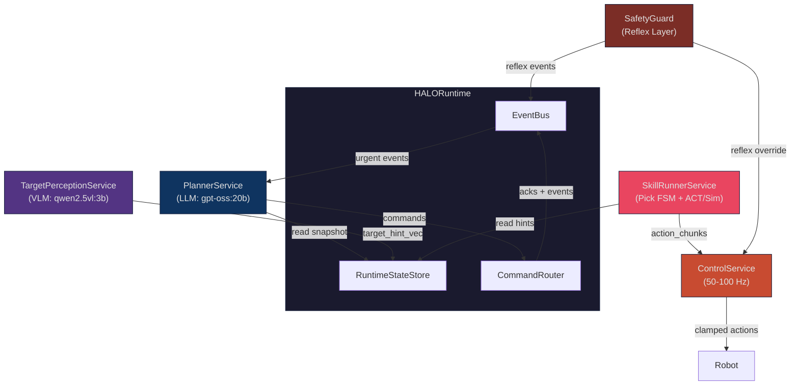
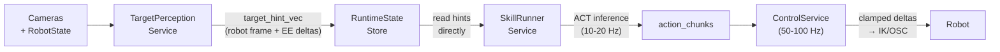
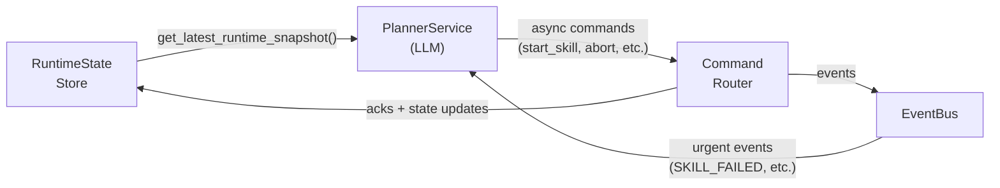
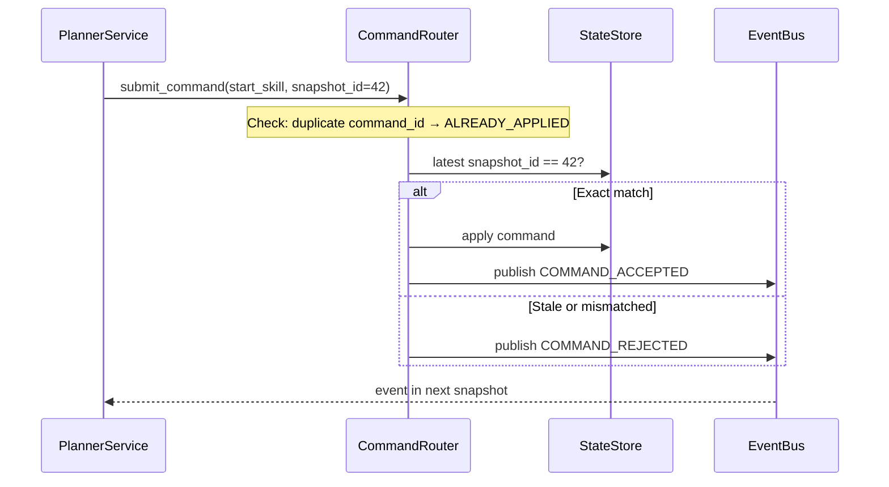
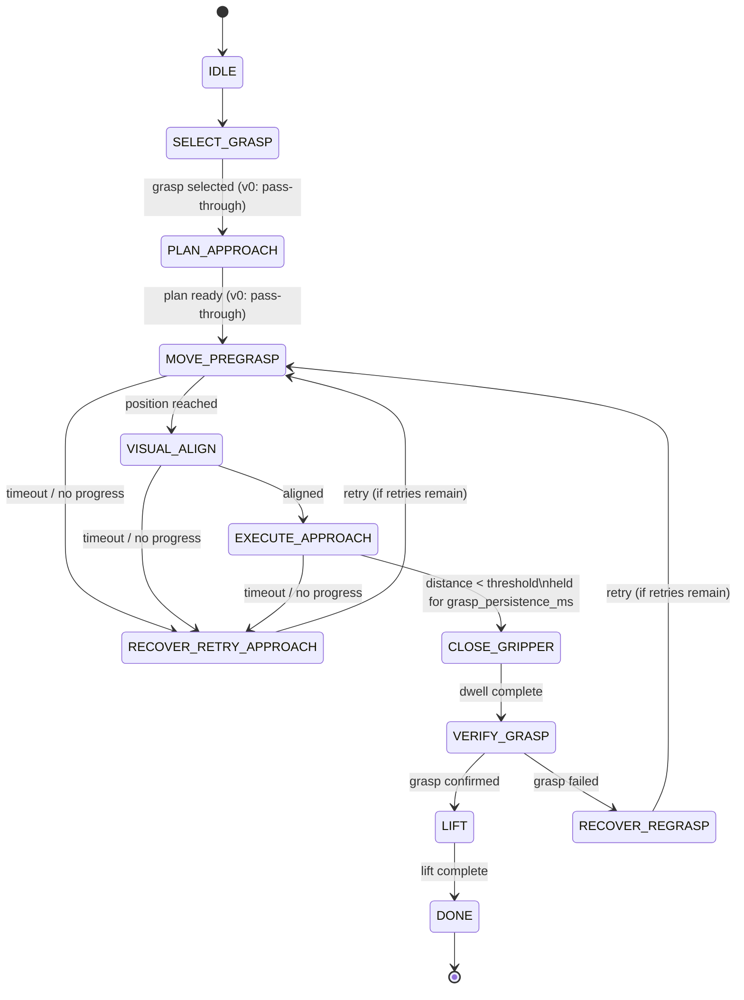
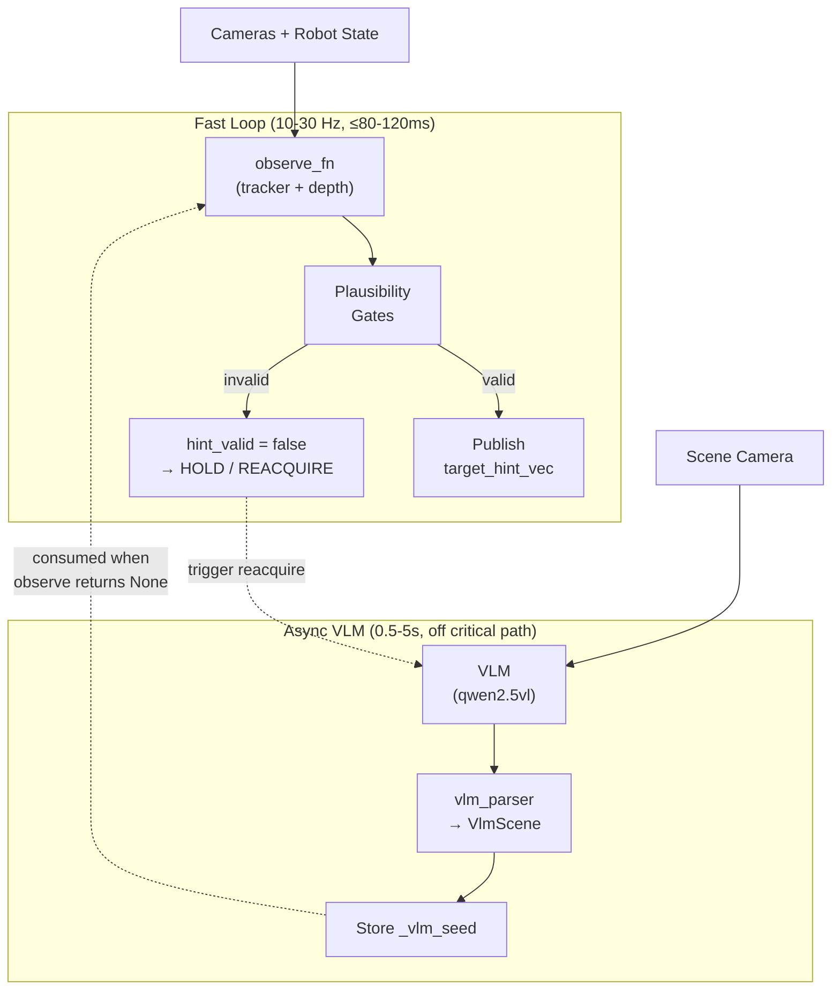
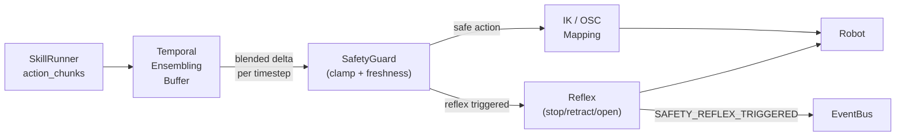
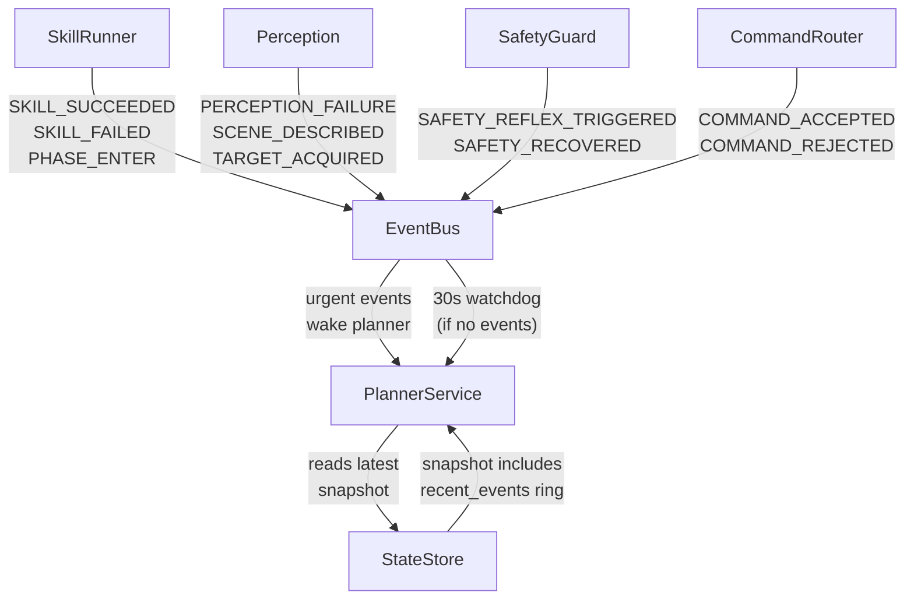

# HALO Architecture

HALO is a robotic manipulation system built around **continuous control decoupled from LLM reasoning** — the robot never pauses motion waiting for the planner.

The project follows a **three-phase sim strategy**: (1) **MuJoCo + SO-101** (current) for teacher demos, ACT training data, and closed-loop eval; (2) **Isaac Lab** (future) for GPU-accelerated parallel envs and domain randomization; (3) **Real SO-ARM101 hardware** (later). The v0 software backbone (services, contracts, planner agent, TUI) is fully implemented and tested.

---

## System Overview

Five services with strict role separation, coordinated through a shared runtime:

| Service | Rate | Role |
|---|---|---|
| **PlannerService** | event-driven (30 s watchdog) | Task orchestration, skill selection, retries, recovery |
| **TargetPerceptionService** | 10–30 Hz + async VLM | Target discovery/tracking, fused hints, failure codes |
| **SkillRunnerService** | 10–20 Hz | Pick FSM, phase transitions, ACT chunk buffering; dual-mode (ACT + sim) |
| **ControlService** | 50–100 Hz (target); 10 Hz in v0 sim | Real-time action streaming, temporal ensembling, safety |
| **SafetyGuard** | Hard real-time | Delta limits, hint freshness gating, reflexes |



---

## Dataflows

The system has two independent paths — a high-frequency **control path** (machine-to-machine, no LLM) and a low-frequency **decision path** (LLM-driven).

### Control Path

Numeric control hints flow machine-to-machine and never enter LLM context.



### Decision Path

The planner reads compact snapshots and issues async commands. It never blocks the control loop.



---

## Command Protocol

Every mutating command carries a `command_id` (UUID) and `precondition_snapshot_id`. The router enforces idempotency and uses **strict optimistic concurrency**: `precondition_snapshot_id` must exactly equal the current `snapshot_id` (not >=). If the world has moved on, the command is rejected and the planner must re-read and retry.



### Planner Tools

| Tool | Precondition | Purpose |
|---|---|---|
| `start_skill(skill, target, options)` | snapshot_id | Launch a skill (pick, place) |
| `abort_skill(skill_run_id, reason)` | snapshot_id | Abort a running skill |
| `override_target(skill_run_id, handle)` | snapshot_id | Retarget mid-skill |
| `describe_scene(reason)` | None (stateless) | Trigger async VLM scene analysis |
| `track_object(target_handle)` | None (stateless) | Set perception tracking target |

---

## Pick Skill FSM

The SkillRunnerService drives a deterministic FSM. Phase transitions are fast and local — the planner only starts/aborts skills, never times micro-actions.



**Key invariant:** `CLOSE_GRIPPER` is triggered deterministically when `distance < grasp_distance_threshold_m` held for `grasp_persistence_ms`. The planner never commands "close gripper now". Wrist camera is active in `VISUAL_ALIGN`, `EXECUTE_APPROACH`, `CLOSE_GRIPPER`, and `VERIFY_GRASP`.

### Dual-Mode SkillRunner (ACT vs Sim)

The SkillRunnerService operates in two modes:

- **ACT mode** (default): uses `chunk_fn` (ACT inference) + `push_fn` (ControlService) for end-effector delta control.
- **Sim mode**: uses `start_pick_fn` (triggers autonomous trajectory on SimServer) + `sim_phase_fn` (polls phase/done from telemetry). No joint chunk pushing needed — the server runs physics autonomously.

```python
# Sim mode callables
StartPickFn = Callable[[str, str], Awaitable[dict]]   # (arm_id, target_body) → server response
SimPhaseFn  = Callable[[], tuple[int, bool]]           # () → (phase_id, done)
```

In sim mode, `start_skill()` calls `start_pick_fn`; a `start_pick_error` response triggers `SKILL_FAILED` with `NO_GRASP`. The `_tick_sim()` method reads phase from `sim_phase_fn` and syncs the FSM via `sync_phase()` (forward-only transitions). On `SKILL_SUCCEEDED`, the `held_object_handle` in the state store is set to the target; on failure/abort it is cleared.

### Held-Object State

`PlannerSnapshot.held_object_handle` tracks which object is in the gripper after a successful pick. The planner system prompt enforces: if `held_object_handle` is not null, never start another PICK — ask for a place target first.

---

## TargetPerceptionService

Two loops: a fast tracking loop (10–30 Hz) and an async VLM loop for scene analysis/reacquisition.



### VLM Handle Deduplication

VLM may return multiple detections with the same handle. After parsing, `dedupe_detection_handles()` renames duplicates to `{handle}_dup2`, `{handle}_dup3`, etc., guaranteeing unique handles downstream. The scene prompt also detects the robot hand/gripper (`robot_hand_NN` handle, `is_graspable: false`).

### Normalised Coordinates

All perception coordinates are **normalised to 0..1** throughout the system. `TargetInfo.center_px`, `TargetInfo.bbox_xywh`, `VlmDetection.bbox`, and `VlmDetection.centroid` carry normalised values. Denormalisation to pixels happens only at OpenCV/drawing boundaries (`feed_viewer.py`, `tracker_fn.py`). `parse_vlm_response()` accepts `img_w`/`img_h` for normalisation.

### Perception Failure Codes

`OK` · `OCCLUDED` · `OUT_OF_VIEW` · `DEPTH_INVALID` · `MULTIPLE_CANDIDATES` · `CALIB_INVALID` · `TRACK_JUMP_REJECTED` · `REACQUIRE_FAILED`

---

## ControlService & Safety

The ControlService applies temporal ensembling to blend overlapping action chunks into smooth per-timestep deltas. Target rate is 50–100 Hz for real hardware; v0 MuJoCo sim uses 10 Hz for debugging simplicity.



### Safety Guards (v0)

- Per-timestep linear delta limit (`max_linear_delta_m`)
- Per-timestep angular delta limit (`max_angular_delta_rad`)
- Hint freshness gating (`obs_age_ms`, `time_skew_ms` thresholds)
- Reflex: immediate stop/retract/open-gripper on unsafe conditions

The LLM cannot bypass safety guards.

---

## Event Flow

Services communicate asynchronously through the EventBus. The planner wakes on urgent events.



### Urgent Events (wake PlannerService)

`SKILL_SUCCEEDED` · `SKILL_FAILED` · `SAFETY_REFLEX_TRIGGERED` · `PERCEPTION_FAILURE` · `SCENE_DESCRIBED` · `TARGET_ACQUIRED` · `COMMAND_REJECTED`

---

## Planner Snapshot

The planner sees exactly **one** compact snapshot (the latest). Old snapshots are replaced, never appended.

Snapshot field groups:
- **Identity**: `snapshot_id`, `arm_id`, `ts_ms`
- **Skill**: name, phase, `skill_run_id` | **Target**: `hint_valid`, confidence, `obs_age_ms`, `delta_xyz_ee`, `distance_m`
- **Perception**: `tracking_status`, `failure_code` | **ACT**: status, `buffer_fill_ms`, `buffer_low`
- **Progress/Outcome**: `elapsed_ms`, `no_progress_ms`, `delta_distance`, state, `reason_code`
- **Safety**: state, `reflex_active` | **Misc**: `command_acks`, `recent_events` (ring of 8), `held_object_handle`

---

## ACT Action Space

**HALO core** (runtime/bridge) actions are **per-timestep servo increments** in the end-effector frame:

```
[Δx, Δy, Δz, Δroll, Δpitch, Δyaw, gripper_cmd]   (7D EE-frame deltas)
```

**MuJoCo sim** (`mujoco_sim/`) uses **joint-position targets** written directly to `data.ctrl[:]`:

```
[shoulder_pan, shoulder_lift, elbow_flex, wrist_flex, wrist_roll, gripper]   (6D joint positions)
```

The action spaces are **intentionally different** — conversion is the responsibility of the `apply_fn` factory. Constants sync tests verify phase/gripper alignment but not action format.

- Deltas are applied relative to the **current measured** EE pose (closed-loop)
- Temporal ensembling blends overlapping chunk predictions per-timestep
- On phase transition, the buffer is trimmed to ~50–100 ms to avoid stale tail actions
- **v0 MuJoCo profile:** 20 Hz control (10 Hz ACT), 10-step chunks (1 s horizon). Production target is 50–100 Hz with shorter horizons (200–500 ms).

---

## Timing Budgets

| Path | Target | v0 Sim |
|---|---|---|
| ControlService tick | 50–100 Hz (10–20 ms) | 20 Hz (50 ms) in MuJoCo |
| Fast perception loop → hint publish | ≤ 80–120 ms | same |
| VLM reacquire (async, off critical path) | 0.5–5 s | same |
| ACT chunk horizon | 200–500 ms | 1 s (10 steps) |
| ACT buffer fill target | 150–300 ms | ~1 s |
| Planner watchdog | 30 s max between ticks | same |

---

## Cognitive Backend Switching (`halo/cognitive/`)

Transparent proxy layer that routes planner and VLM calls through a **Switchboard** to either a **LOCAL** (Ollama) or **CLOUD** (Gemini Live API / remote HTTP) backend. Services call `switchboard.decide()` / `switchboard.vlm_scene()` as drop-in replacements — unaware of which backend is active.

- **Switchboard**: retry logic, failure counting (3 consecutive → failover), warm-up handoff on failback, health loop (5 s interval)
- **LeaseManager**: epoch-monotonic grants with UUID token + TTL; `CommandRouter` rejects stale epoch/token — prevents split-brain
- **ContextStore**: append-only journal (bounded to 200 entries) with cursor-based sync for incremental warm-up during failback
- **CompactionPlugin**: ADK-native event compaction callback; propagates summaries to inactive backend for concise failback context
- **Backends**: `LocalCognitiveBackend` (ADK + LiteLLM/Ollama), `RemoteCognitiveBackend` (HTTP client to Cloud Run)

See `docs/halo_architecture.md` §17 for detailed failover/failback/compaction sequence diagrams.

---

## MuJoCo Simulation (`mujoco_sim/`)

Phase 1 of the sim strategy. Raw MuJoCo + SO-101 arm (5-DOF + 1-DOF gripper, 6 actuated joints). Generates teacher pick demos, records episodes to HDF5, and bridges to HALO runtime via ZMQ. Separate workspace member with its own `pyproject.toml`.

### Trajectory Planning Pipeline

PickTeacher pre-computes a full trajectory on first `step()`, then samples in real time:

```
grasp_planner (64 candidates, geometric filter, IK scoring)
  → keyframe_planner (5 SE(3) keyframes: home → pregrasp → grasp → close → lift)
    → waypoint_generator (IK with yaw-retry fallbacks)
      → trajectory (jerk-limited ruckig segments, start/end at rest)
        → pick_teacher.step() samples at elapsed time → (action, phase_id, done)
```

**Teacher phase sequence:** `IDLE(0) → MOVE_PREGRASP(3) → EXECUTE_APPROACH(5) → CLOSE_GRIPPER(6) → LIFT(8) → DONE(9)`. Planning-only phases (SELECT_GRASP, PLAN_APPROACH, VISUAL_ALIGN) are folded into the initial computation.

Episode generation: reset → 5 s stabilization → teacher loop → write HDF5 → verify lift. **100% success rate** with current tuning. Use `make generate-episodes` to produce datasets.

### Constants Sync

Phase IDs, gripper semantics, and wrist-active phases are synced between `halo/contracts/enums.py` and `mujoco_sim/constants.py`, verified by cross-module tests. Action space intentionally diverged (sim: 6D joint-position, core: 7D EE-delta).

See `mujoco_sim/CLAUDE.md` for full details (env, dataset format, scene constants, IK, grasp planner, contact solver tuning).

---

## ZMQ Bridge (`halo/bridge/`)

Connects the HALO runtime to the MuJoCo sim server via a 2-channel ZMQ protocol.

| Channel | ZMQ Pattern | Port | Direction | Purpose |
|---------|-------------|------|-----------|---------|
| **TelemetryStream** | PUB/SUB | 5560 | Sim → HALO | Frames + state @ 10 Hz |
| **CommandRPC** | REQ/REP | 5561 | HALO → Sim | step, reset, start_pick, configure, shutdown |

**SimServer** (`mujoco_sim.server`) runs an autonomous physics loop at 20 Hz, plans and executes trajectories, and publishes telemetry. Single-threaded (macOS OpenGL constraint). Protocol: msgpack + JPEG. **SimClient** (`sim_client.py`) provides a thread-safe command interface with background telemetry reception; `BridgeTransportError` on timeout (ControlService catches → `ActStatus.STALE`). **SimSource** (`sim_source.py`) wraps SimClient as a drop-in video source (`capture_fn` → `CapturedFrame`). No env resets between skills — arm stays at final position, sim runs continuously.
