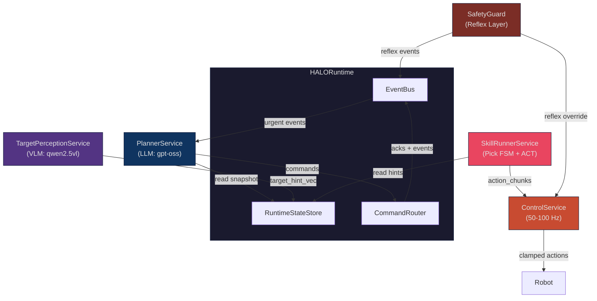
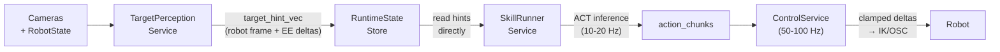
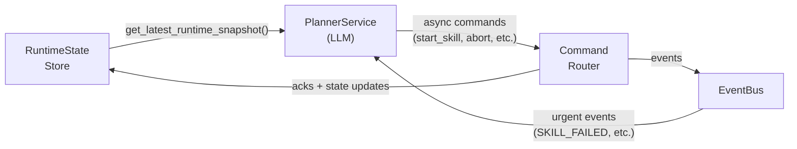
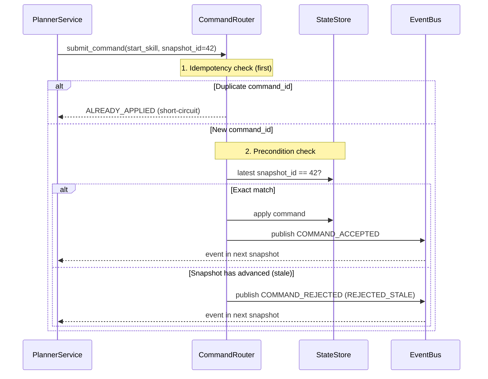
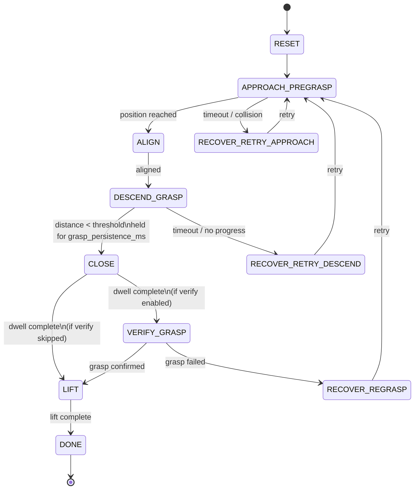
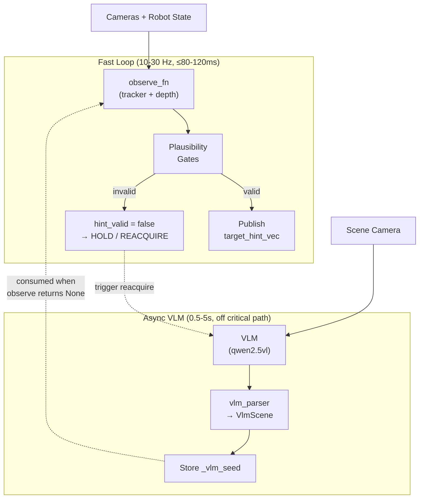
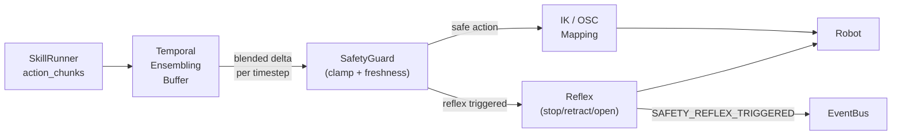
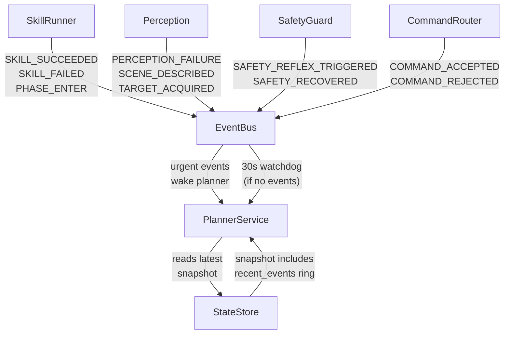
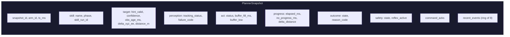

# HALO Architecture

HALO is a robotic manipulation system built around **continuous control decoupled from LLM reasoning** — the robot never pauses motion waiting for the planner.

The project is developed in phases: **v0** implements the full software backbone (services, contracts, planner agent, TUI) tested with mocks. **v1** wires everything to **Isaac Sim/Lab** for end-to-end sim training and evaluation. Real SO-ARM101 hardware is a later phase.

---

## System Overview

Five services with strict role separation, coordinated through a shared runtime:

| Service | Rate | Role |
|---|---|---|
| **PlannerService** | event-driven (30 s watchdog) | Task orchestration, skill selection, retries, recovery |
| **TargetPerceptionService** | 10–30 Hz + async VLM | Target discovery/tracking, fused hints, failure codes |
| **SkillRunnerService** | 10–20 Hz | Pick FSM, phase transitions, ACT chunk buffering |
| **ControlService** | 50–100 Hz (target); 10 Hz in v0 sim | Real-time action streaming, temporal ensembling, safety |
| **SafetyGuard** | Hard real-time | Delta limits, hint freshness gating, reflexes |



---

## Dataflows

The system has two independent paths — a high-frequency **control path** (machine-to-machine, no LLM) and a low-frequency **decision path** (LLM-driven).

### Control Path

Numeric control hints flow machine-to-machine and never enter LLM context.



### Decision Path

The planner reads compact snapshots and issues async commands. It never blocks the control loop.



---

## Command Protocol

Every mutating command carries a `command_id` (UUID) and `precondition_snapshot_id`. The router enforces idempotency and uses **strict optimistic concurrency**: `precondition_snapshot_id` must exactly equal the current `snapshot_id` (not >=). If the world has moved on, the command is rejected and the planner must re-read and retry.



### Planner Tools

| Tool | Precondition | Purpose |
|---|---|---|
| `start_skill(skill, target, options)` | snapshot_id | Launch a skill (pick, place) |
| `abort_skill(skill_run_id, reason)` | snapshot_id | Abort a running skill |
| `override_target(skill_run_id, handle)` | snapshot_id | Retarget mid-skill |
| `describe_scene(reason)` | None (stateless) | Trigger async VLM scene analysis |
| `track_object(target_handle)` | None (stateless) | Set perception tracking target |

---

## Pick Skill FSM

The SkillRunnerService drives a deterministic FSM. Phase transitions are fast and local — the planner only starts/aborts skills, never times micro-actions.



**Key invariant:** `CLOSE` is triggered deterministically when `distance < grasp_distance_threshold_m` held for `grasp_persistence_ms`. The planner never commands "close gripper now".

---

## TargetPerceptionService

Two loops: a fast tracking loop (10–30 Hz) and an async VLM loop for scene analysis/reacquisition.



### Perception Failure Codes

`OK` · `OCCLUDED` · `OUT_OF_VIEW` · `DEPTH_INVALID` · `MULTIPLE_CANDIDATES` · `CALIB_INVALID` · `TRACK_JUMP_REJECTED` · `REACQUIRE_FAILED`

---

## ControlService & Safety

The ControlService applies temporal ensembling to blend overlapping action chunks into smooth per-timestep deltas. Target rate is 50–100 Hz for real hardware; v0 Isaac Lab uses 10 Hz for debugging simplicity.



### Safety Guards (v0)

- Per-timestep linear delta limit (`max_linear_delta_m`)
- Per-timestep angular delta limit (`max_angular_delta_rad`)
- Hint freshness gating (`obs_age_ms`, `time_skew_ms` thresholds)
- Reflex: immediate stop/retract/open-gripper on unsafe conditions

The LLM cannot bypass safety guards.

---

## Event Flow

Services communicate asynchronously through the EventBus. The planner wakes on urgent events.



### Urgent Events (wake PlannerService)

`SKILL_SUCCEEDED` · `SKILL_FAILED` · `SAFETY_REFLEX_TRIGGERED` · `PERCEPTION_FAILURE` · `SCENE_DESCRIBED` · `TARGET_ACQUIRED` · `COMMAND_REJECTED`

---

## Planner Snapshot

The planner sees exactly **one** compact snapshot (the latest). Old snapshots are replaced, never appended.



---

## ACT Action Space

Actions are **per-timestep servo increments** in the end-effector frame:

```
[Δx, Δy, Δz, Δroll, Δpitch, Δyaw, gripper_cmd]
```

- Deltas are applied relative to the **current measured** EE pose (closed-loop)
- Temporal ensembling blends overlapping chunk predictions per-timestep
- On phase transition, the buffer is trimmed to ~50–100 ms to avoid stale tail actions
- **v0 Isaac Lab profile:** 10 Hz control rate, 10-step chunks (1 s horizon) for debugging simplicity. Production target is 50–100 Hz with shorter horizons (200–500 ms).

---

## Timing Budgets

```mermaid
gantt
    title Service Timing Budgets
    dateFormat X
    axisFormat %L ms

    section Control
    ControlService tick (target 50-100 Hz) :0, 20
    ControlService tick (v0 sim 10 Hz)     :0, 100

    section Skill
    ACT inference (10-20 Hz)           :0, 100

    section Perception
    Fast loop (tracker + depth + gates) :0, 120
    VLM reacquire (async)              :0, 5000

    section Planner
    LLM decide (event-driven)          :0, 5000
    Watchdog fallback                  :0, 30000
```



| Path | Target | v0 Sim |
|---|---|---|
| ControlService tick | 50–100 Hz (10–20 ms) | 10 Hz (100 ms) |
| Fast perception loop → hint publish | ≤ 80–120 ms | same |
| VLM reacquire (async, off critical path) | 0.5–5 s | same |
| ACT chunk horizon | 200–500 ms | 1 s (10 steps) |
| ACT buffer fill target | 150–300 ms | ~1 s |
| Planner watchdog | 30 s max between ticks | same |
