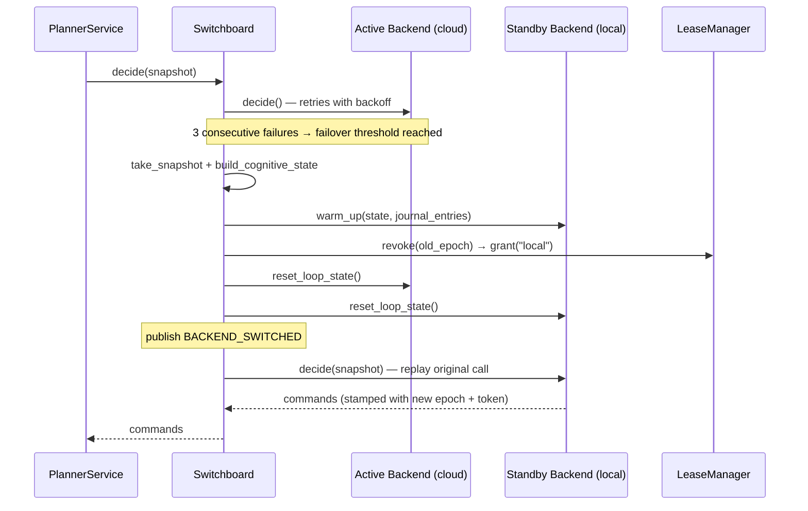
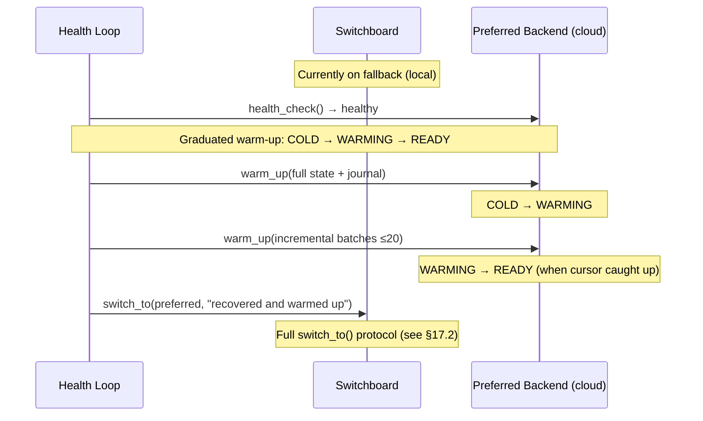
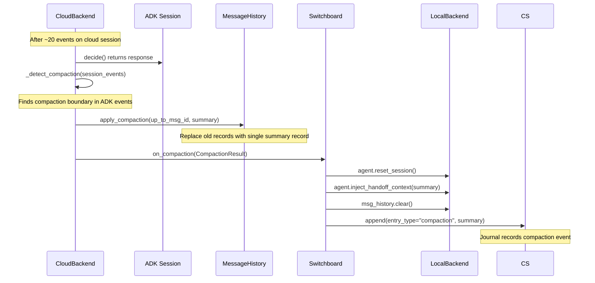

# HALO Architecture Specification (Planner + Perception + ACT Skill Runner)

Date: 2026-03-05
Scope: HALO — three-phase sim strategy: (1) MuJoCo + SO-101 (current), (2) Isaac Lab (future), (3) real SO-ARM101 hardware (later). Single-arm pick/place, local models via Ollama, ACT for continuous control.

This document is the **architecture reference** that complements the plan summary. It focuses on **module boundaries, runtime contracts, dataflows, timing**, and **code-facing interfaces**.

---

## 0) Design principles (non-negotiables)

1) **No stop-and-go motion**
- Continuous control runs independently of LLM reasoning.
- Planning is low-frequency and **never blocks** control.

2) **Deterministic safety**
- Safety-critical decisions live outside the LLM loop (hard guards + reflex layer).

3) **Keep numeric control hints out of LLM context**
- Target vectors, transforms, and controller tuning are passed machine-to-machine.
- Planner consumes **compact snapshots**, not raw telemetry.

4) **Fresh perception over long memory**
- State is summarized into a *latest snapshot* plus a small event ring.
- Old snapshots are deprecated/overwritten in planner context.

---

## 1) System overview

### 1.1 Major services

**PlannerService (LLM agent; stateful, low-rate)**
- Chooses next high-level action: start skill, abort, retry, retarget, request refresh.
- Reads the latest runtime snapshot; writes commands.
- Does *not* time micro-actions like “close gripper now”.

**TargetPerceptionService (unified perception; medium-rate)**
- Maintains a track on the active target and publishes fused **target hints**.
- Internals (not exposed to planner): VLM grounding, segmentation, tracking, depth fusion, plausibility gates.

**SkillRunnerService (deterministic executor; medium-rate)**
- Runs a **fixed FSM** per skill (Pick, Place, etc.).
- Calls ACT to generate action chunks.
- Uses fast success checks to transition phases (approach → align → grasp → lift).

**ControlService (real-time loop; high-rate)**
- Streams actions at 50–100Hz (or as required).
- Applies smoothing + clamps + safety interlocks.
- Never waits on LLM, VLM

**Safety/Reflex (hard real-time-ish)**
- Immediate stop/retract/open-gripper on unsafe conditions.
- Publishes reflex events; returns to safe-hold mode.

**RuntimeStateStore + EventBus**
- Single source of truth for:
  - current skill/phase
  - target hint + validity
  - ACT buffer status
  - safety state
  - command acknowledgements
  - recent events
- Transport can be ROS2 topics, ZeroMQ, shared memory, Redis, etc. (choose later; contracts stay stable).

---

## 2) Deployment topology (processes/threads)

### 2.1 Suggested processes
- `planner_service` (LLM + tool adapter)
- `target_perception_service` (VLM + SAM/Tracker + depth fusion)
- `skill_runner_service` (FSM + ACT inference + chunk planner)
- `control_service` (realtime executor + safety + reflex)
- `mujoco_sim.server` (sim-only: ZMQ server owning SO101Env + PickTeacher; single-threaded for macOS OpenGL)
- (optional) `logger_service` (episode capture + dataset writer)

### 2.2 Threading expectations
- Control loop thread has the highest priority; avoid allocations.
- Perception runs separate capture + inference threads (ZED capture + tracking + VLM reacquire jobs).
- SkillRunner runs FSM tick + ACT inference thread(s).
- Planner is single-threaded from an orchestration standpoint.

---

## 3) Dataflows

### 3.1 Control path (machine-to-machine, low latency)
```
Cameras + RobotState
   -> TargetPerceptionService
       -> target_hint_vec (robot frame + EE-relative deltas, validity, confidence)
           -> RuntimeStateStore
               -> SkillRunnerService
                   -> ACT (chunk inference)
                       -> action_chunks
                           -> ControlService (50–100Hz streaming + clamps)
                               -> Robot
```

**Rule:** SkillRunner reads `target_hint_vec` directly from runtime state — it does not go through the Planner.

### 3.2 Decision path (LLM; low frequency)
```
RuntimeStateStore -> get_latest_runtime_snapshot() -> PlannerService -> async commands -> RuntimeStateStore
```

Planner issues commands **asynchronously**. Results appear in:
- command ack fields in snapshots
- event stream (accepted/rejected/stale/already_applied)
- skill outcome events

---

## 4) Timing, rates, and budgets

### 4.1 Typical rates (v0 defaults)
- ControlService: **50–100 Hz** (target); **20 Hz** in v0 MuJoCo sim
- ACT inference: **10–20 Hz** (producing short action chunks)
- Wrist camera for ACT: as needed, ideally aligned to ACT rate
- TargetPerceptionService fusion publish: **10–30 Hz** (tracking; fast loop budget ≤80–120ms, excludes VLM reacquire)
- VLM reacquire: event-driven, low duty cycle
- PlannerService: **event-driven** (tick on SKILL_SUCCEEDED/FAILED, SAFETY_REFLEX_TRIGGERED, PERCEPTION_FAILURE, SCENE_DESCRIBED, TARGET_ACQUIRED, COMMAND_REJECTED) + **30 s watchdog** fallback. No fixed polling rate — decide_fn (LLM) is awaited before the next event is processed, so ticks are always serialized.

### 4.2 Action chunk buffering (receding horizon)
- Predict horizon: ~200–500ms for moving targets
- Maintain buffer fill: ~150–300ms
- On phase transition: trim buffer to ~50–100ms to avoid “old-phase tail actions”.

### 4.3 Latency budgets (fast loop vs. semantic fallback)

- **Fast perception loop (steady-state):** tracker + depth fusion + plausibility gates + hint publish should target **≤80–120ms** end-to-end (camera frame timestamp → `target_hint_vec` published). This is the budget that supports moving targets.
- **Semantic reacquire loop (VLM):** runs **asynchronously** and is allowed to take **hundreds of ms to several seconds**. It must **never** sit on the critical path of the steady-state 10–30Hz hint publish loop.
  - Triggered only on startup acquisition, repeated validity failures (`hint_valid=false`), `OUT_OF_VIEW`, repeated `TRACK_JUMP_REJECTED`, or explicit refresh requests.
  - Output is a coarse **seed** (bbox/point/ROI + optional label) used to initialize SAM/Tracker, which then resumes the fast loop.

---

## 5) Frames, calibration, and timestamp discipline

### 5.1 Required transforms (calibrated)
- `T_base<-scene_cam` (ZED)
- `T_ee<-wrist_cam` (UVC)
- `T_base<-ee` (kinematics)
- (optional) object/world frames as needed

### 5.2 Timestamp fields (must be present in every hint)
- `hint_ts`
- `robot_state_ts` (EE pose source)
- `time_skew_ms = hint_ts - robot_state_ts`
- `obs_age_ms = now - hint_ts`

### 5.3 Freshness gating (safety interlock)
If `obs_age_ms` or `time_skew_ms` exceeds thresholds:
- `hint_valid = false`
- SkillRunner switches to REACQUIRE / HOLD state
- ControlService may hold position or execute a safe retreat depending on policy

---

## 6) TargetPerceptionService internals (black-box to planner)

### 6.1 Pipeline stages
1) **Target acquisition / reacquisition** (rare, async)
   - VLM runs as an **asynchronous job** to find candidate objects/regions in the scene camera.
   - Output is a coarse seed (bbox/point/ROI + optional label) to initialize segmentation/tracking; it is **not** part of the steady-state tracking loop.
2) **Segmentation** (init/refine)
   - SAM/SAM2 produces a mask for the selected candidate.
3) **Tracking** (continuous)
   - Fast tracker updates mask / keypoints at frame rate.
4) **Depth fusion**
   - Mask + ZED depth -> 3D estimate.
5) **Plausibility gates**
   - Reject impossible motion, low depth-valid ratio, track jumps, etc.
6) **Hint publication**
   - Publish both base-frame pose and EE-relative deltas + confidence.

### 6.2 Implemented modules

**`vlm_parser.py`** — Parse VLM JSON responses into typed dataclasses:
- `VlmDetection` (frozen): `handle`, `label`, `bbox` (x1, y1, x2, y2), `centroid` (computed midpoint), `is_graspable`
- `VlmScene` (frozen): `scene` (description string), `detections` (list)
- `parse_vlm_response(response: dict) -> VlmScene`

**`ollama_vlm_fn.py`** — Ollama VLM integration (async, scene camera only):
- `make_ollama_vlm_fn(base_url, model, prompt_path, ...) -> VlmFn` — factory returning async fn
- Input images resized to `_VLM_INPUT_WIDTH = 1024` for stable bbox coords
- Prompt loaded from `configs/perception/scene_analysis.md`
- `VlmFn = Callable[[str, object], Awaitable[VlmScene]]` — (arm_id, image) → scene analysis result
- Image provided per-call by the service (captured from camera via `capture_fn`)

**`video_capture_fn.py`** — Video file camera simulation:
- `make_video_capture_fn(video_path) -> CaptureFn` — factory returning async fn backed by a looping video file (OpenCV)

**`mock_fns.py`** — Test factories:
- `make_mock_capture_fn() -> CaptureFn` — synthetic frames with counter
- `make_mock_tracker_factory_fn(init_hint, update_hint) -> TrackerFactoryFn` — predictable tracker

**`service.py`** — TargetPerceptionService orchestrates the fast loop + async VLM:
- Type aliases: `ObserveFn = Callable[[str, str], Awaitable[TargetInfo | None]]`, `VlmFn = Callable[[str, object], Awaitable[VlmScene]]`
- VLM is optional (`vlm_fn=None` disables async reacquisition)
- At most one VLM task at a time; result stored as `_vlm_seed`, consumed by `tick()` when `observe_fn` returns `None`
- VLM result publishes `SCENE_DESCRIBED` event and is logged via `RunLogger.log_vlm_result()`

### 6.3 VLM prompt (`configs/perception/scene_analysis.md`)
Structured prompt for Qwen2.5-VL:
- Detect cubes, boxes, containers, balls, bottles, cups on the table surface
- JSON output: `{"scene":"...","detections":[{"handle":"...","label":"...","bounding_box":[x1,y1,x2,y2],"is_graspable":bool}]}`
- `handle` format: `<type>-<N>` (e.g., `cube-1`, `box-2`)

### 6.4 Health/failure codes (stable enums)
- `OCCLUDED`
- `OUT_OF_VIEW`
- `DEPTH_INVALID`
- `MULTIPLE_CANDIDATES`
- `CALIB_INVALID`
- `TRACK_JUMP_REJECTED`
- `REACQUIRE_FAILED`
- `OK`

### 6.5 What the planner can request
- `set_tracking_target(...)` — also available as `track_object(target_handle)` planner tool
- `describe_scene(reason)` — triggers async VLM scene analysis; result delivered via `SCENE_DESCRIBED` event

---

## 7) SkillRunner architecture (FSM + ACT)

### 7.1 What SkillRunner owns
- Skill FSM and phase transitions
- Phase-conditioned policy inputs (`phase_id`)
- Fast success checks and retry logic
- Buffer trimming and chunk scheduling
- Optional verification hooks (e.g., VLM verify after grasp)

### 7.2 Pick skill FSM (implemented states)
- `IDLE` (0) — initial state
- `SELECT_GRASP` (1) — v0 pass-through (immediate transition)
- `PLAN_APPROACH` (2) — v0 pass-through (immediate transition)
- `MOVE_PREGRASP` (3) — move to pregrasp pose
- `VISUAL_ALIGN` (4) — fine alignment (wrist camera active)
- `EXECUTE_APPROACH` (5) — descend to grasp pose; grasp persistence timer starts when distance < threshold (wrist camera active)
- `CLOSE_GRIPPER` (6) — gripper close + dwell (wrist camera active)
- `VERIFY_GRASP` (7) — optional (configurable via `skip_verify_grasp`) (wrist camera active)
- `LIFT` (8) — lift after grasp (wrist camera active)
- `DONE` (9) — terminal state (outcome: SUCCESS or FAILURE with reason code)
- Place reserved: `PLACE_*` (30–33)
- Recovery: `RECOVER_RETRY_APPROACH` (50), `RECOVER_REGRASP` (51), `RECOVER_ABORT` (52)

**Critical:** `CLOSE_GRIPPER` is triggered deterministically when distance < `grasp_distance_threshold_m` held for `grasp_persistence_ms`, not by the planner.

Wrist camera active phases: `VISUAL_ALIGN`, `EXECUTE_APPROACH`, `CLOSE_GRIPPER`, `VERIFY_GRASP`, `LIFT` (defined as `WRIST_ACTIVE_PHASES` in `contracts/enums.py`).

### 7.3 Outcome monitoring
A `SkillOutcomeMonitor` computes:
- `in_progress | success | failure | uncertain`
- `reason_code`
- `needs_verify`

Signals:
- target following EE, height change, in-bin containment
- gripper width/effort/current (if available)
- progress watchdog (`delta_distance`, `no_progress_ms`)
- safety/reflex events

---

## 8) ACT integration contract

### 8.1 Inputs to ACT
- Wrist RGB (primary)
- Robot proprio (joints, gripper)
- Low-dimensional target hints (prefer EE-relative)
- `phase_id` token

### 8.2 Outputs from ACT
- Action chunks in a fixed action space (define explicitly; v0 example):
  - **HALO core (runtime/bridge):** `Δx, Δy, Δz, Δroll, Δpitch, Δyaw, gripper_cmd` — 7D EE-frame deltas
  - **MuJoCo sim (`mujoco_sim/`):** `shoulder_pan, shoulder_lift, elbow_flex, wrist_flex, wrist_roll, gripper` — 6D joint-position targets written to `data.ctrl[:]`
- Chunk timestamps + ids for traceability.
- Action space is **intentionally different** between core and sim (EE-delta vs joint-position); conversion is the responsibility of the `apply_fn` factory.

**Delta semantics (v0 default, to avoid drift):**
- Each `Δ*` is a **per-timestep incremental command in the EE frame**, applied relative to the **current measured** EE pose (receding-horizon servo), with the low-level controller closing the loop.
- Do **not** integrate and “play back” a full chunk open-loop; always treat chunks as a short rolling buffer that is continuously refreshed.
- If using temporal ensembling, ensemble **in action space per timestep** (i.e., overlapping predicted deltas are blended into a *single* commanded delta sequence) before mapping to IK/OSC.

**Alternative encodings (if drift shows up):**
- Predict **absolute EE poses relative to the chunk start** (or joint targets) and treat ACT output as setpoints; this often transfers better to real hardware when controllers have latency.

### 8.3 Execution mapping
- SkillRunner generates desired deltas.
- ControlService maps deltas to your low-level controller (IK / resolved-rate / operational space) with:
  - clamps (vel/acc/jerk)
  - interpolation / sample-and-hold
  - collision/workspace limits

---

## 9) SafetyGuard + Reflex layer

### 9.1 Hard guards (pre-execution)
v0 implements:
- per-timestep linear/angular delta magnitude limits (`max_linear_delta_m`, `max_angular_delta_rad`)
- stale-hint / invalid-calibration interlocks (hint freshness gating in ControlService)

Planned (not yet implemented):
- absolute workspace AABB limits
- velocity/acceleration/jerk rate limits
- coarse collision checks

### 9.2 Reflexes (immediate overrides)
- stop
- retract-to-safe pose
- open gripper
- disable torque / estop integration as appropriate

### 9.3 Contract with planner
- Planner may request recovery actions only after robot is stabilized.
- Reflex events are surfaced in snapshot + event stream.

---

## 10) Runtime contracts (commands, snapshots, events)

### 10.1 Command protocol (async + idempotent)

**Command envelope**
```json
{
  "command_id": "uuid",
  "arm_id": "arm0",
  "issued_at_ms": 0,
  "type": "start_skill | abort_skill | override_target | describe_scene | track_object",
  "precondition_snapshot_id": "snap-123 | null",
  "payload": {}
}
```

**Idempotency rules**
- duplicate `command_id` => `ALREADY_APPLIED`
- stale precondition => `REJECTED_STALE`
- wrong skill_run => `REJECTED_WRONG_SKILL_RUN`
- `precondition_snapshot_id = null` (used by `describe_scene`, `track_object`) => accepted without precondition check

### 10.2 Planner snapshot (compact, planner-grade)

```json
{
  "snapshot_id": "snap-123",
  "ts_ms": 0,
  "arm_id": "arm0",

  "skill": {"name": "pick", "skill_run_id": "run-9", "phase": "PREGRASP_ALIGN"},
  "target": {
    "handle": "cube-1",
    "hint_valid": true,
    "confidence": 0.84,
    "obs_age_ms": 23,
    "time_skew_ms": -5,
    "delta_xyz_ee": [0.03, -0.01, 0.08],
    "distance_m": 0.09
  },

  "perception": {"tracking_status": "tracking", "failure_code": "OK", "reacquire_fail_count": 0},
  "act": {"status": "running", "buffer_fill_ms": 220, "buffer_low": false},

  "progress": {"elapsed_ms": 4300, "no_progress_ms": 0, "delta_distance": -0.01},
  "outcome": {"state": "in_progress", "reason_code": null, "needs_verify": false},

  "safety": {"state": "OK", "reflex_active": false, "reason_codes": []},

  "command_acks": [{"command_id": "uuid", "status": "ACCEPTED"}],
  "recent_events": [{"event_id": "evt-77", "type": "PHASE_ENTER", "data": {"phase": "PREGRASP_ALIGN"}}]
}
```

**Planner context rule (implementation-critical):**
- The planner must see **exactly one** `get_latest_runtime_snapshot()` payload: the *latest* one.
- When a new snapshot arrives, middleware must **replace** the prior snapshot tool output in the LLM context (do not append multiple snapshots).
- Keep only a small `recent_events` ring; never stream raw telemetry into the planner prompt.
- Every mutating command must include `precondition_snapshot_id`; the command router must reject stale preconditions even if the LLM repeats calls. Stateless commands (`describe_scene`, `track_object`) set `precondition_snapshot_id = null` to avoid premature rejection.


### 10.3 Event stream (small, canonical)
Event types:
- `COMMAND_ACCEPTED / COMMAND_REJECTED`
- `SKILL_STARTED / SKILL_SUCCEEDED / SKILL_FAILED`
- `PHASE_ENTER / PHASE_EXIT`
- `PERCEPTION_FAILURE / PERCEPTION_RECOVERED`
- `SCENE_DESCRIBED`
- `TARGET_ACQUIRED`
- `SAFETY_REFLEX_TRIGGERED / SAFETY_RECOVERED`

---

## 11) Logging, tracing, and dataset capture

### 11.1 What to log (minimum)
- `snapshot_id`, `skill_run_id`, `phase`, `chunk_id`
- `target_hint_version` (monotonic counter)
- `command_id` + ack status
- state transitions with reason codes
- safety events + reflex reasons
- per-episode success/failure labels

### 11.2 Dataset episode schema (teleop-aligned)
Record at ACT timestep:
- wrist RGB
- robot state
- executed action
- `phase_id`
- target hints (EE-relative)
- success/failure per episode

Add QA filters:
- dropped frames / timestamp gaps
- saturation/clipping frequency
- replay mismatch > threshold
- corrupted images

---

## 12) Extensibility notes

### 12.1 Multi-arm
Namespace everything by `arm_id` from day one:
- runtime state partitions
- command routing
- calibration sets
- logs and dataset episodes

### 12.2 Adding skills
Each skill should provide:
- FSM definition (states, transitions, predicates)
- ACT phase ids (stable enums)
- per-phase thresholds + timing profile
- outcome monitor rules
- failure taxonomy mapping

### 12.3 Debug / inspection mode
Expose a separate debug snapshot tool that can include:
- full joint arrays
- raw transforms
- detailed tracker stats
- last N images metadata
Keep it **off** the steady-state planner loop.

---

## 13) Repo structure

See the **Repository Structure** section in the top-level `CLAUDE.md` for the authoritative directory listing. Each service directory also contains its own `CLAUDE.md` with detailed internal docs (tick order, config tables, integration points, testing notes).

---

## 14) Quick “who owns what” checklist

- **Planner** owns: task orchestration, retries, retargeting, high-level recovery decisions.
- **Perception** owns: target discovery/track, fused hints, validity/confidence, failure codes.
- **SkillRunner** owns: phase timing, success predicates, ACT chunking, micro-retries.
- **ControlService** owns: real-time streaming, smoothing, clamps, enforcing safety gates.
- **Safety/Reflex** owns: immediate overrides; LLM cannot bypass.

---

## 15) MuJoCo simulation module (`mujoco_sim/`)

Phase 1 of the sim strategy. Raw MuJoCo + SO-101 arm (5-DOF + 1-DOF gripper, 6 actuated joints). Generates teacher pick demos, records episodes to HDF5, and bridges to HALO runtime via ZMQ. Separate workspace member with its own `pyproject.toml`.

### 15.1 Trajectory planning pipeline

PickTeacher pre-computes a full trajectory on first `step()`, then samples in real time:

```
grasp_planner (64 candidates, geometric filter, IK scoring)
  → keyframe_planner (5 SE(3) keyframes: home → pregrasp → grasp → close → lift)
    → waypoint_generator (IK with yaw-retry fallbacks)
      → trajectory (jerk-limited ruckig segments, start/end at rest)
        → pick_teacher.step() samples at elapsed time → (action, phase_id, done)
```

Teacher phase sequence: `IDLE → MOVE_PREGRASP → EXECUTE_APPROACH → CLOSE_GRIPPER → LIFT → DONE`. Planning-only phases (SELECT_GRASP, PLAN_APPROACH, VISUAL_ALIGN) are folded into the initial computation.

### 15.2 Constants sync

Phase IDs, gripper semantics, wrist-active phases synced between `halo/contracts/enums.py` and `mujoco_sim/constants.py`, verified by cross-module tests. Action space intentionally different (sim: 6D joint-position, core: 7D EE-delta).

See `mujoco_sim/CLAUDE.md` for full details (env, dataset format, scene constants, IK, grasp planner, contact solver tuning).

---

## 16) ZMQ bridge (`halo/bridge/`)

Connects HALO runtime to the MuJoCo sim server via 2-channel ZMQ.

| Channel | ZMQ Pattern | Port | Direction | Purpose |
|---------|-------------|------|-----------|---------|
| TelemetryStream | PUB/SUB | 5560 | Sim → HALO | Frames + state @ 10 Hz |
| CommandRPC | REQ/REP | 5561 | HALO → Sim | step, reset, start_pick, configure, shutdown |

**SimServer** (`mujoco_sim.server`) runs an autonomous physics loop at 20 Hz, plans and executes trajectories, and publishes telemetry. Single-threaded (macOS OpenGL constraint). Protocol: msgpack + JPEG. **SimClient** (`sim_client.py`) provides a thread-safe command interface with background telemetry reception; `BridgeTransportError` on timeout (ControlService catches → `ActStatus.STALE`). **SimSource** (`sim_source.py`) wraps SimClient as a drop-in video source (`capture_fn` → `CapturedFrame`).

---

## 17) Cognitive backend switching (`halo/cognitive/`)

Transparent proxy layer that routes planner (LLM) and perception (VLM) calls through a **Switchboard** to one of two backends — **LOCAL** (Ollama) or **CLOUD** (Gemini Live API / remote HTTP). Split-brain prevention via **LeaseManager**, context continuity via **ContextStore**, and ADK-native event compaction with cross-backend sync.

PlannerService and TargetPerceptionService call `switchboard.decide()` / `switchboard.vlm_scene()` as drop-in replacements — they are unaware of which backend is active.

### 17.1 Component overview

| File | Role |
|---|---|
| `config.py` | `BackendType`, `BackendReadiness`, `CognitiveConfig`, `LocalConfig`, `CloudConfig`, `RemoteCloudConfig`, `CompactionConfig` |
| `backend.py` | `CognitiveBackend` protocol (decide + vlm_scene + health_check), `WarmableBackend` extension (warm_up + readiness + caught_up_cursor) |
| `switchboard.py` | Transparent proxy, retry logic, failure counting, failover/failback, health loop, event journal loop, compaction sync |
| `lease.py` | `LeaseManager` + `Lease` — epoch-monotonic grants with UUID token + TTL; `CommandRouter` rejects stale epoch/token |
| `context_store.py` | `ContextStore` (append-only journal), `ContextEntry`, `ContextSnapshot`, `CognitiveState` for handoff |
| `compactor.py` | `MessageHistory` (UUID-tracked parallel message list), `CompactionResult` for cross-backend sync |
| `compaction_plugin.py` | `CompactionPlugin` — ADK-native event compaction callback; detects compaction boundaries and triggers cross-backend sync |
| `local_backend.py` | `LocalCognitiveBackend` — wraps PlannerAgent (ADK + LiteLLM/Ollama) + Ollama VLM |
| `remote_backend.py` | `RemoteCognitiveBackend` — HTTP client to Cloud Run cognitive service |
| `live_session.py` | `LivePlannerSession` — Gemini Live API session management |
| `audio_io.py` | Audio capture/playback for voice interaction with cloud backend |

### 17.2 Failover flow

When the active backend fails 3 consecutive times (retries exhausted or non-retryable 429/quota errors), the Switchboard automatically fails over to the alternate backend.



### 17.3 Failback flow (warm-up handoff)

A background health loop (every 5 s) checks whether the preferred backend has recovered. Failback uses a graduated warm-up protocol to ensure seamless context transfer before switching.



### 17.4 ADK compaction and cross-backend sync

The cloud backend uses ADK-native event compaction to keep session context bounded. When compaction occurs, the summary is propagated to the inactive local backend so failback starts with concise context.



### 17.5 Lease protocol

The `LeaseManager` prevents split-brain — only one backend may issue commands at a time.

- **Epoch**: monotonically increasing integer, incremented on every `grant()`
- **Token**: UUID string, unique per grant — prevents replayed commands from a prior epoch that happen to share the same epoch number
- **TTL**: 30 s default, renewed on every successful `decide()` / `vlm_scene()` call
- **Validation**: `CommandRouter` checks both `epoch` and `lease_token` on every command when a `LeaseManager` is active; commands with missing or stale values are rejected

Lifecycle: `grant(holder) → renew(epoch) → revoke(epoch) → grant(new_holder)`

### 17.6 ContextStore journal

Append-only journal (bounded to 200 entries) that captures what the planner knows and has decided, enabling context transfer across backend switches.

**Entry types:**

| Type | When recorded | Effect on tracked state |
|---|---|---|
| `decision` | After successful `decide()` with reasoning | Clears `pending_operator_instruction` |
| `scene` | After successful `vlm_scene()` | Updates `known_scene_handles`, `last_scene_description` |
| `event` | Runtime events (SKILL_STARTED/SUCCEEDED/FAILED, SAFETY_REFLEX, TARGET_ACQUIRED, PERCEPTION_FAILURE) | — |
| `operator` | Operator instruction received | Sets `pending_operator_instruction` |
| `compaction` | ADK compaction detected | — |

**Handoff**: `build_cognitive_state()` produces a `CognitiveState` with journal-derived context (recent decisions, events, goal summary) plus snapshot-derived runtime state (skill phase, outcome, held object) — everything a new backend needs to resume without calling back to the edge runtime.

**Cursor-based sync**: `get_entries_after(cursor)` enables incremental catch-up. `WarmableBackend.caught_up_cursor` tracks how far the standby backend has consumed, enabling bounded batch warm-up during failback.

---

## Appendix A — Naming conventions (stable)

- `PlannerService`
- `TargetPerceptionService`
- `SkillRunnerService`
- `ControlService`
- `SafetyGuard`, `ReflexLayer`
- `SkillOutcomeMonitor`
- `RuntimeStateStore`, `EventBus`
