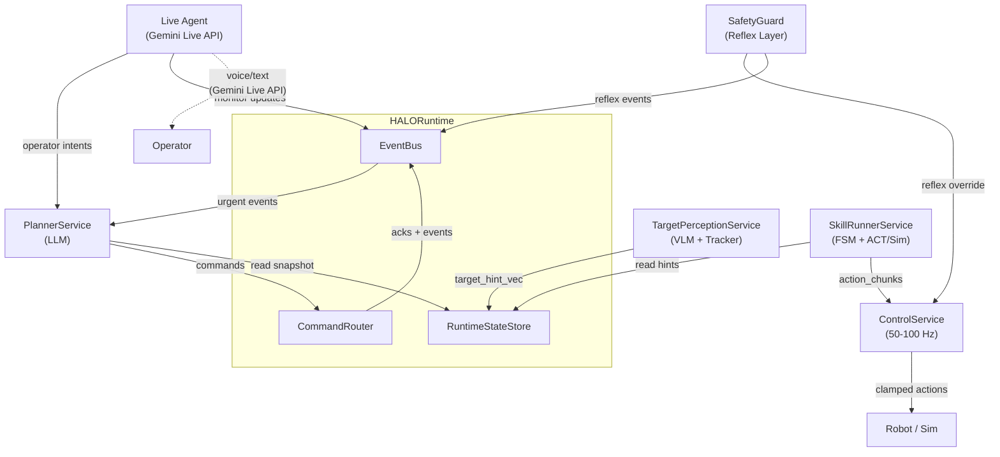
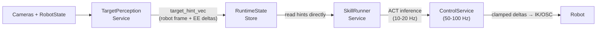
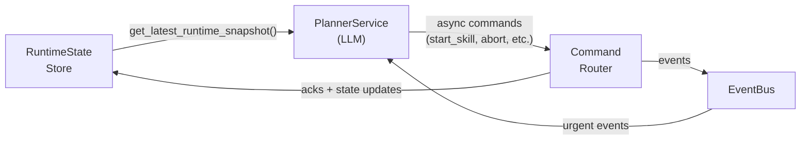
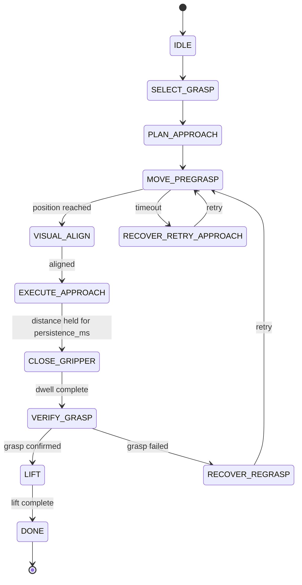
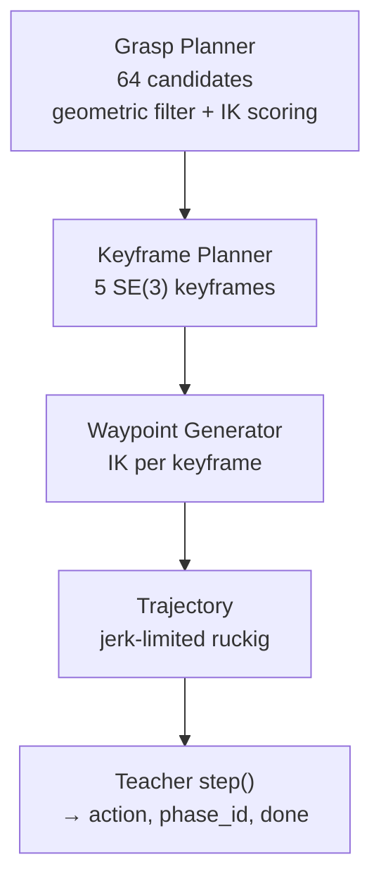
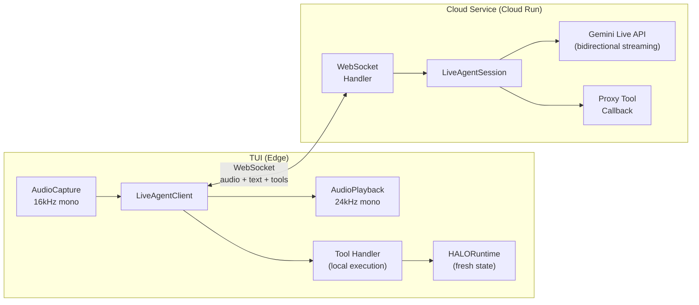
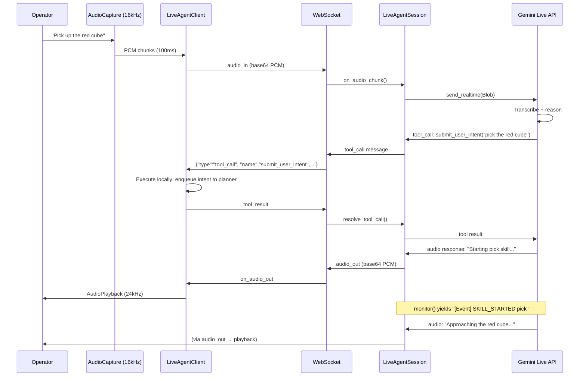
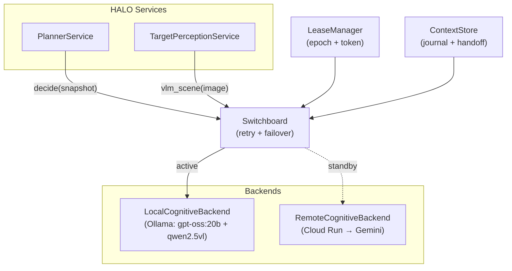
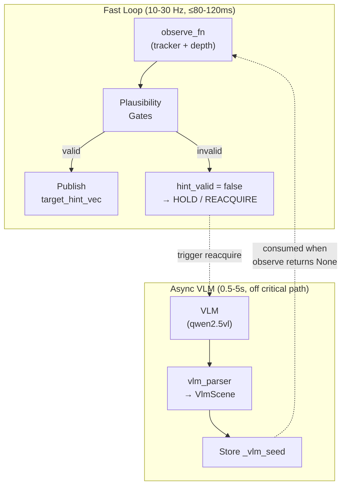

# HALO Architecture

HALO is a robotic manipulation system that separates continuous motor control from LLM-based task planning. The core challenge it addresses: how to combine the flexibility of language model reasoning with the strict timing requirements of real-time robot control, without sacrificing either.

The architecture is robot-agnostic — it works with any arm that has 5+ DOF and a gripper. The control path operates on end-effector frame deltas, so swapping robots requires only an IK solver and controller mapping. The current development target is the [SO-ARM101](https://github.com/TheRobotStudio/SO-ARM100) (5-DOF + 1-DOF gripper), validated end-to-end in MuJoCo simulation.

The system uses an LLM agent to decide *what* to do (which object to pick, where to place it, when to retry) while deterministic services handle *how* to do it (motion planning, visual tracking, safety enforcement). These two paths run independently — the robot maintains smooth motion even when the LLM is mid-inference.

An operator can interact with the system through voice and text via a **Live Agent** built on the Gemini Live API — a conversational layer that narrates robot actions, answers questions about the scene, and forwards operator intents to the planner.

## Design Philosophy

**No stop-and-go motion.** Continuous control runs independently of LLM reasoning. The ControlService streams actions at 50-100 Hz regardless of whether the planner is thinking. Planning is low-frequency and never blocks the motion loop.

**Deterministic safety.** Safety-critical decisions live outside the LLM loop. The SafetyGuard enforces per-timestep delta limits and hint freshness gating as hard interlocks. Reflexes (stop, retract, open gripper) trigger immediately on unsafe conditions. The LLM cannot bypass these guards — it can only request recovery *after* the reflex has stabilized the robot.

**Numeric control hints stay out of LLM context.** Target vectors, transforms, and controller tuning flow machine-to-machine between perception and control services. The planner consumes compact, human-readable snapshots — not raw telemetry. This prevents the LLM from inventing temporal logic over numeric streams it cannot reason about reliably.

**Fresh perception over long memory.** The planner sees exactly one snapshot: the latest. Old snapshots are replaced, never appended. A small ring of recent events provides context, but the system trusts current state over accumulated history.

## System Architecture

Five services with strict role separation, coordinated through a shared runtime:

| Service | Rate | Owns |
|---|---|---|
| **PlannerService** | Event-driven (30 s watchdog) | Task orchestration, skill selection, retries, recovery. LLM via Ollama or Gemini. |
| **TargetPerceptionService** | 10-30 Hz (fast loop) + async VLM | Target discovery/tracking, fused target hints, validity/confidence, failure codes. |
| **SkillRunnerService** | 10-20 Hz | Skill FSMs, phase transitions, ACT chunk buffering, dual-mode (ACT + sim). |
| **ControlService** | 50-100 Hz | Real-time action streaming, temporal ensembling, per-timestep delta clamping. |
| **SafetyGuard / ReflexLayer** | Hard real-time | Delta limits, hint freshness gating, immediate overrides. |

The **HALORuntime** owns the RuntimeStateStore, EventBus, and CommandRouter. It exposes two APIs: `get_latest_runtime_snapshot(arm_id)` for the planner to read state, and `submit_command(cmd)` for the planner to issue actions.



## Dataflows

The system has two independent paths that never block each other.

### Control Path (machine-to-machine, no LLM)

Numeric control hints flow directly between services. The SkillRunner reads target hints from the RuntimeStateStore — they never pass through the planner.



### Decision Path (LLM, low frequency)

The planner reads the latest compact snapshot, reasons about it, and issues async commands. Results appear in subsequent snapshots and events.



## Skills and FSM Engine

Skills are defined as **Mermaid stateDiagram-v2** files in `configs/skills/`. A generic FSM engine parses these diagrams into executable state machines with handler-based execution. This means skill topology is authored visually and the runtime engine is skill-agnostic.

Three skills are implemented: **PICK**, **PLACE**, and **TRACK**. The SkillRunnerService operates in two modes:
- **ACT mode**: uses chunk inference + ControlService for end-effector delta control
- **Sim mode**: triggers autonomous trajectories on the MuJoCo SimServer and monitors progress via telemetry

The planner has three tools: `start_skill`, `abort_skill`, and `describe_scene`. It starts and monitors skills but never times micro-actions like "close gripper now".

### Pick Skill FSM



`CLOSE_GRIPPER` is triggered deterministically when distance stays below threshold for `grasp_persistence_ms`. The planner never commands gripper actions directly.

## MuJoCo Simulation

MuJoCo is the primary development and validation environment for HALO. It provides a physics-accurate SO-101 arm (5-DOF + 1-DOF gripper) with two cameras (scene 1280x720, wrist 640x480), contact dynamics tuned for reliable grasping, and an autonomous sim server that runs the full pick-and-place pipeline without human teleoperation.

The sim is used for rapid iteration on the entire stack — from trajectory planning through FSM execution to planner integration — before moving to real hardware. The HALO runtime connects to the sim server over ZMQ and treats it as a real robot: same command protocol, same telemetry stream, same skill lifecycle.

### Teacher Model and Trajectory Planning

Instead of human teleoperation, HALO uses an **analytic teacher** to generate expert demonstrations for training an ACT (Action Chunking Transformer) imitation learning policy. The teacher pre-computes a full trajectory on the first step, then samples actions in real time at the control rate:



**Grasp planner**: enumerates 64 candidates across 4 cube side faces, filters by geometric feasibility (pregrasp above table, no gripper-body collision), scores by a weighted combination of IK position error, joint margin, orientation error, manipulability, and tilt penalty. Falls back to expanded search with relaxed tolerances if no valid grasp is found.

**Trajectory planning**: converts scored grasps into SE(3) keyframes, solves IK at each keyframe with yaw-retry (0, 90, -90, 180 degrees), then generates jerk-limited ruckig profiles with per-joint velocity/acceleration/jerk limits. All segments start and end at rest. Clearance validation rejects trajectories that come too close to the table.

**Teacher phase sequence**: `IDLE → MOVE_PREGRASP → EXECUTE_APPROACH → CLOSE_GRIPPER → LIFT → DONE`. Planning-only phases (SELECT_GRASP, PLAN_APPROACH, VISUAL_ALIGN) are folded into the initial computation. A place teacher handles `SELECT_PLACE → TRANSIT_PREPLACE → DESCEND_PLACE → OPEN → RETREAT → DONE`.

### Episode Generation and Dataset

Teacher demonstrations are recorded as HDF5 episodes with phase-labeled timesteps:

```
ep_000000.hdf5
├── obs/
│   ├── rgb_scene      (T, 720, 1280, 3)    scene camera
│   ├── rgb_wrist      (T, 480, 640, 3)     wrist camera
│   ├── joint_pos      (T, 6)               actuated joint positions
│   ├── ee_pose        (T, 7)               end-effector pose (xyz + quat)
│   ├── gripper        (T,)                 gripper joint angle
│   ├── phase_id       (T,) int32           FSM phase label per timestep
│   ├── object_pose    (T, 7)               ground-truth object pose
│   └── ...
├── action             (T, 6)               joint-position targets
└── attrs: seed, control_freq=20, robot="SO101", success
```

Episodes are generated with `make generate-episodes` (configurable: `EPISODES=10 EPISODE_DIR=episodes SEED_BASE=0`). Each run: reset with seeded randomization → 5 s physics stabilization → teacher loop → write HDF5 → verify lift success (cube Z must rise >= 5 mm). Pick-and-place episodes chain both skills in sequence.

### From Teacher Demos to ACT

The dataset is designed to train a skill-conditioned **ACT** (Action Chunking Transformer) policy:

1. **Generate** 10k-50k clean teacher episodes (100% success rate with current tuning)
2. **Train** skill-conditioned ACT: input `(wrist_rgb, proprio, phase_token)` → output `chunk_len x action_dim`
3. **Evaluate** closed-loop: FSM orchestrator + ACT-predicted actions replace teacher actions
4. **Scale** with domain randomization (lighting, textures, object placement)
5. **Transfer** to real hardware with identical dataset schema

The action space is intentionally different between sim teacher (6D joint-position targets) and HALO runtime ACT (7D EE-frame deltas). Conversion is handled by the `apply_fn` factory. Dataset schema stays identical between sim and real — same observation keys, same chunking, same phase labels.

### SimServer Architecture

The SimServer runs physics autonomously at 20 Hz and communicates with the HALO runtime over two ZMQ channels:

| Channel | ZMQ Pattern | Port | Direction | Purpose |
|---------|-------------|------|-----------|---------|
| TelemetryStream | PUB/SUB | 5560 | Sim → HALO | Frames + state @ 10 Hz |
| CommandRPC | REQ/REP | 5561 | HALO → Sim | step, reset, start_pick, start_place, configure, shutdown |

The server is single-threaded (macOS OpenGL constraint). On `start_pick(target_body)`, it pre-computes the full trajectory and begins autonomous execution. The HALO runtime monitors progress via telemetry — phase IDs, joint state, camera frames — and the SkillRunnerService syncs its FSM via forward-only `sync_phase()` transitions. No env resets between skills; the arm stays at its final position and sim runs continuously.

## Live Agent

The Live Agent is a conversational voice and text interface between an operator and the HALO system, built on the **Gemini Live API**. It enables natural interaction with the robot: the operator speaks, the agent narrates what the robot is doing, answers questions about the scene, and forwards operator instructions to the planner.

### Architecture

The Live Agent spans three layers connected by a bidirectional WebSocket:



**TUI side** captures audio at 16 kHz (100 ms chunks) and sends it to the cloud service over WebSocket. Audio responses from Gemini (24 kHz) are played back through the speaker. Tool calls arrive over the same WebSocket and are executed locally against fresh runtime state.

**Cloud side** maintains a persistent Gemini Live API session via ADK `run_live()`. Audio flows continuously via `send_realtime()`. Text and snapshots use request-response via `send_content()`. The session supports automatic reconnection with exponential backoff.

### Proxy-Tool Pattern

The Live Agent uses a proxy-tool architecture that keeps Gemini decoupled from the robot's runtime state. Tools are defined as stubs on the cloud side; actual execution happens on the TUI:

1. Gemini decides to call a tool (e.g., `describe_scene`, `submit_user_intent`, `abort`)
2. ADK's `before_tool_callback` intercepts the call and serializes it over WebSocket to the TUI
3. The TUI executes the tool locally with fresh runtime state (not stale cloud-side state)
4. The result is sent back over WebSocket, unblocking the ADK future
5. Gemini continues its turn with the tool result

This pattern ensures tool actions are always based on the latest robot state, eliminates cloud→edge state synchronization issues, and keeps tool execution within the safety boundary of the TUI process.

**Available tools:**

| Tool | Execution | Purpose |
|---|---|---|
| `describe_scene(reason)` | TUI: submits DescribeSceneCommand to runtime | Trigger VLM scene analysis |
| `submit_user_intent(intent)` | TUI: enqueues intent to planner's operator message queue | Forward operator instruction to planner |
| `abort()` | TUI: submits AbortSkillCommand to runtime | Emergency stop |
| `monitor()` | Cloud: ADK-executed async generator | Receive streaming robot state updates |

The `monitor()` tool is the only tool executed directly by ADK on the cloud side. It yields a continuous stream of robot state updates — events (SKILL_STARTED, SKILL_FAILED, SAFETY_REFLEX_TRIGGERED), planner decisions, and scene descriptions — enabling Gemini to narrate the robot's progress in real time without polling.

### Voice Interaction Flow



### Barge-in and Interruption

The Gemini Live API supports barge-in through Automatic Activity Detection (AAD). When the operator starts speaking while the agent is responding:

1. Gemini signals `event.interrupted = True`
2. The cloud service sends an `interrupt` message over WebSocket
3. The TUI calls `AudioPlayback.clear()` — the speaker stops immediately
4. Gemini processes the new utterance, resuming its turn with the operator's input

AAD is configured with high sensitivity for both start and end of speech, 150 ms prefix padding, and 500 ms silence threshold for end-of-utterance detection.

### WebSocket Protocol

The WebSocket endpoint (`/ws/live/{arm_id}`) carries all data between TUI and cloud:

| Direction | Message Type | Payload |
|-----------|-------------|---------|
| TUI → Cloud | `audio_in` | Base64 PCM (16kHz, mono, int16) |
| TUI → Cloud | `text_in` | Text string |
| TUI → Cloud | `monitor_update` | Category (event/planner_decision/scene_description) + text |
| TUI → Cloud | `tool_result` | call_id + result string |
| Cloud → TUI | `audio_out` | Base64 PCM (24kHz, mono, int16) |
| Cloud → TUI | `text_out` | Agent text response |
| Cloud → TUI | `transcription_in` | Partial/final input transcription |
| Cloud → TUI | `transcription_out` | Partial/final output transcription |
| Cloud → TUI | `tool_call` | call_id + tool name + args |
| Cloud → TUI | `interrupt` | Barge-in signal |
| Cloud → TUI | `status` | Connection/session status |

### Session Management

The `LiveAgentManager` manages per-arm Live Agent sessions with idle eviction (600 s timeout) and LRU eviction (max 8 concurrent sessions). Each session maintains its own Gemini Live API connection, tool state, and monitor queue.

**Configuration:**

| Setting | Default | Purpose |
|---|---|---|
| Model | `gemini-2.5-flash-native-audio-preview` | Gemini model for Live API |
| Voice | `Kore` | Voice preset (also: `Aoede`) |
| Response modalities | AUDIO + TEXT | Multimodal output |
| Session resumption | Enabled | Transparent reconnection |
| Context window compression | Sliding window | Keep session context bounded |

## Cognitive Backend Switching

The **Switchboard** transparently routes planner (LLM) and perception (VLM) calls to one of two backends — **LOCAL** (Ollama) or **CLOUD** (Gemini / Cloud Run). Services call `switchboard.decide()` and `switchboard.vlm_scene()` as drop-in replacements, unaware of which backend is active.



**Failover**: after 3 consecutive failures (retries exhausted or non-retryable 429/quota errors), the Switchboard automatically switches to the alternate backend. On switch, the ContextStore generates a handoff context summary (recent decisions, events, scene state) that is injected into the new backend's first turn.

**Failback**: a background health loop (5 s interval) monitors the preferred backend. When it recovers and passes a health check, the Switchboard switches back with context handoff.

**Context continuity**: three mechanisms keep both backends informed:

- **ContextStore journal** — append-only log (bounded to 200 entries) of decisions, scenes, events, and operator instructions. On backend switch, `get_handoff_context()` produces a text summary injected into the new backend's first message.
- **Message history mirroring** — after every successful cloud `decide()`, the Switchboard copies the cloud's message history to the local backend's `MessageHistory`. If failover occurs, the local backend can rebuild its ADK session from this mirror instead of starting cold.
- **Compaction sync** — when the cloud backend's ADK session compacts (replaces old messages with a summary), the compaction result is propagated to the local backend. The local ADK session is rebuilt with the compacted summary + retained messages, keeping both backends' context aligned and bounded.

**Split-brain prevention**: the LeaseManager issues epoch-monotonic grants with UUID tokens (30 s TTL, renewed on every successful call). The CommandRouter rejects any command with a stale epoch or token, ensuring only one backend can issue commands at a time.

### GCP Deployment

The cloud service deploys to Cloud Run via Terraform. The infrastructure includes:

- **Cloud Run** — cognitive service (scale 0-1, 2 CPU / 2 Gi, concurrency 10)
- **Artifact Registry** — Docker image storage
- **Secret Manager** — `GOOGLE_API_KEY` for Gemini API access
- **Firestore** — optional session persistence with TTL (1 hour default)
- **Service Accounts** — `halo-cognitive` (runs the service) + `halo-tui-invoker` (TUI client authentication via SA impersonation)

See `cloud_service/README.md` for the service and `infra/README.md` for Terraform configuration.

## Perception Pipeline

Two loops with very different timing characteristics:



The **fast loop** runs the tracker, depth fusion, and plausibility gates at 10-30 Hz. It publishes target hints with both base-frame pose and EE-relative deltas. This loop must stay under 80-120 ms end-to-end to support moving targets.

The **async VLM loop** handles initial acquisition, reacquisition after tracking loss, and scene analysis requests. It runs asynchronously and is never on the critical path. VLM output is a coarse seed (bbox/ROI) that initializes the fast tracker.

## Safety

### SafetyGuard (v0 — implemented)

- Per-timestep linear delta limit (`max_linear_delta_m`)
- Per-timestep angular delta limit (`max_angular_delta_rad`)
- Hint freshness gating (`obs_age_ms` and `time_skew_ms` thresholds)
- Reflex layer: immediate stop/retract/open-gripper on unsafe conditions

### Planned extensions

- Workspace AABB limits
- Velocity/acceleration/jerk rate limits
- Coarse collision checks

The planner handles recovery only after the reflex has stabilized the robot. Safety events are surfaced in the snapshot and event stream.

## Timing Budgets

| Path | Target | v0 MuJoCo |
|---|---|---|
| ControlService tick | 50-100 Hz (10-20 ms) | 20 Hz (50 ms) |
| Fast perception → hint publish | ≤ 80-120 ms | same |
| VLM reacquire (async) | 0.5-5 s | same |
| ACT chunk horizon | 200-500 ms | 1 s (10 steps) |
| ACT buffer fill target | 150-300 ms | ~1 s |
| Planner watchdog | 30 s max between ticks | same |

## Key Design Invariants

1. SkillRunner reads `target_hint_vec` directly from runtime state — never through the planner.
2. Planner sees exactly one snapshot: the latest. Old snapshots are replaced, not appended.
3. Every mutating command carries `command_id` (UUID) and `precondition_snapshot_id`; the router enforces idempotency and rejects stale preconditions.
4. VLM reacquire runs asynchronously — never on the critical path of the 10-30 Hz hint-publish loop.
5. On phase transition, the ACT buffer is trimmed to ~50-100 ms to avoid executing old-phase tail actions.
6. When a LeaseManager is active, every command must carry both `epoch` and `lease_token`. Stale values are rejected.
7. Dataset schema stays identical between sim and real (same observation keys, chunking, phase labels). Action space conversion (6D joint-position ↔ 7D EE-delta) is handled by the `apply_fn` factory.
8. All state is namespaced by `arm_id` from day one.
